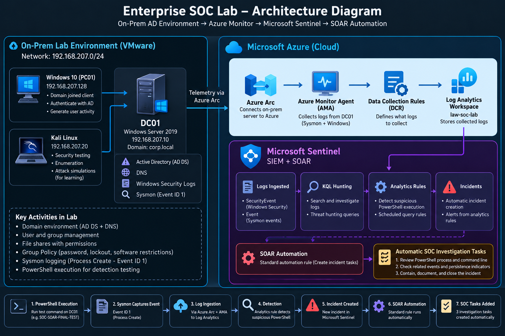

# Architecture Explanation

## Hybrid Enterprise SOC Architecture

The project connects a local VMware-based Active Directory environment to Microsoft Azure and Microsoft Sentinel.


A dark-background version is also included:



## Data Flow

```text
Windows 10 Client / Kali Linux
            |
            | Controlled authentication and security-testing activity
            v
         DC01
 Windows Server 2019
 Active Directory + DNS
 Windows Security Logs + Sysmon
            |
            v
        Azure Arc
            |
            v
   Azure Monitor Agent
            |
            v
  Data Collection Rules
            |
      +-----+------+
      |            |
      v            v
SecurityEvent     Event
      |            |
      +-----+------+
            |
            v
 Log Analytics Workspace
       law-soc-lab
            |
            v
   Microsoft Sentinel
            |
   +--------+---------+----------------+
   |                  |                |
   v                  v                v
KQL Hunting     Analytics Rules     Incidents
                       |                |
                       v                v
                 MITRE Mapping     Investigation
                                        |
                                        v
                                Response / Recovery
                                        |
                                        v
                                SOAR Automation
                                        |
                                        v
                             Automated SOC Tasks
```

## Components

### VMware Lab

The local enterprise lab contains:

- `DC01` — Windows Server 2019 domain controller and DNS server
- Windows 10 domain client — authentication and account-lockout testing
- Kali Linux — controlled security testing and validation

### DC01

`DC01` is the main monitored system.

```text
Hostname: DC01
Domain: corp.local
IP: 192.168.207.10/24
Gateway: 192.168.207.2
```

It produces:

- Windows Security events
- Sysmon process events
- Sysmon registry events
- Active Directory identity events

### Azure Arc

Azure Arc connects the on-premises VMware server to Azure management without moving the server into Azure.

### Azure Monitor Agent

Azure Monitor Agent collects the configured telemetry from the Arc-connected server.

### Data Collection Rules

The main Windows Security DCR is:

```text
dcr-dc01-security-events
```

It sends configured event data to:

```text
law-soc-lab
```

### Log Analytics

The workspace stores the telemetry used by Microsoft Sentinel.

Primary tables:

```text
SecurityEvent
Event
```

### Microsoft Sentinel

Sentinel provides:

- KQL investigation
- Custom analytics rules
- Alerts
- Incidents
- MITRE ATT&CK mapping
- Threat hunting
- Automation rules
- SOC investigation tasks

## Important Scope Note

Only `DC01` was directly onboarded through Azure Arc / AMA for this SOC project.

The Windows 10 and Kali systems generated controlled activity against the lab, but the architecture does not falsely show them as independently onboarded monitored endpoints.

## Detection-to-Response Flow

```text
Controlled Activity
      ↓
Security / Sysmon Event
      ↓
Azure Ingestion
      ↓
KQL Detection
      ↓
Sentinel Alert
      ↓
Incident
      ↓
Analyst Investigation
      ↓
Threat Hunt
      ↓
Containment / Recovery
      ↓
Verification Event
      ↓
Automation / Closure
```

This architecture demonstrates a small but complete hybrid SOC workflow.
