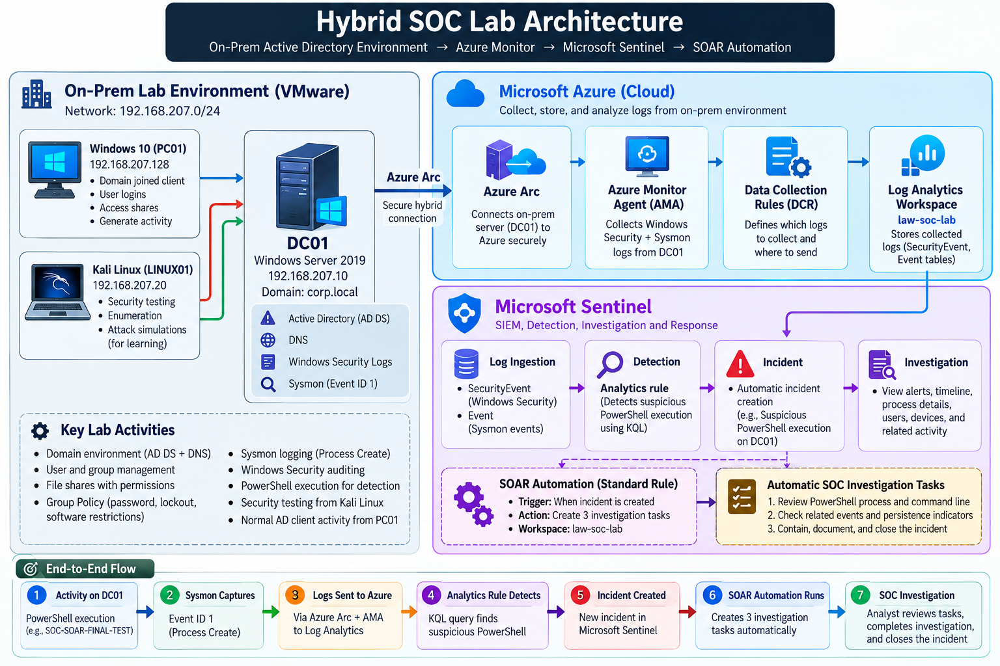
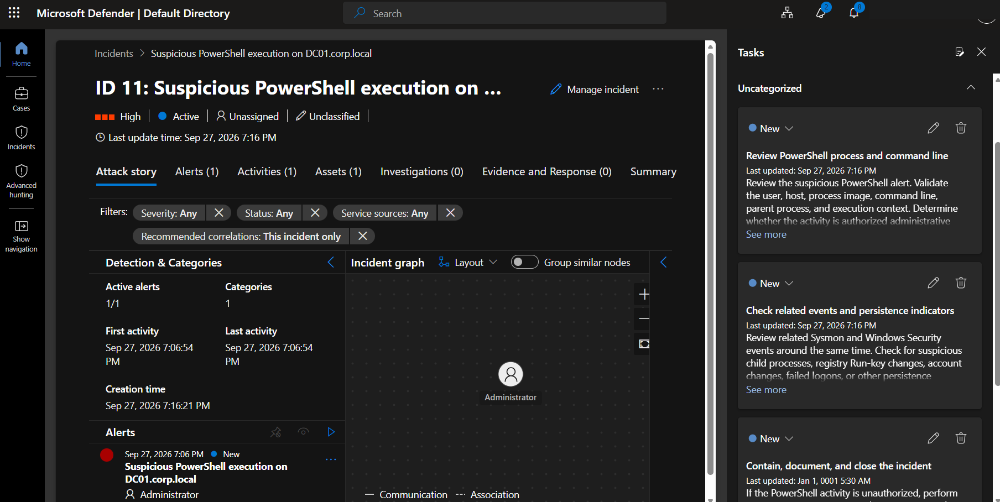

# Hybrid Enterprise SOC, Threat Detection & Incident Response Lab

A hands-on blue-team project that connects a VMware-based Active Directory environment to Microsoft Azure and Microsoft Sentinel, then demonstrates telemetry collection, custom detection engineering, incident investigation, threat hunting, response verification, MITRE ATT&CK mapping, and SOC automation.

> All activity was performed inside an authorized private lab. No production or third-party environment was targeted.



---

## Project Highlights

| Capability | Completed |
|---|---:|
| Custom Microsoft Sentinel analytics rules | 6 |
| Proactive KQL threat hunts | 5 |
| Detailed incident case studies | 5 |
| Verified containment / recovery exercises | 3 |
| MITRE ATT&CK-mapped detection scenarios | 6 |
| Working SOC automation workflow | 1 |
| Automated investigation tasks | 3 |

The project demonstrates the complete workflow:

```text
Security Activity
      ↓
Windows Security / Sysmon
      ↓
Azure Arc + AMA + DCR
      ↓
Log Analytics
      ↓
Microsoft Sentinel
      ↓
Detection / Hunting
      ↓
Incident Investigation
      ↓
Containment / Recovery
      ↓
Verification
      ↓
SOC Automation
```

---

## Lab Environment

| Component | Configuration |
|---|---|
| Hypervisor | VMware |
| Domain Controller | Windows Server 2019 — `DC01` |
| Active Directory Domain | `corp.local` |
| DC01 Address | `192.168.207.10/24` |
| Windows Client | Windows 10 domain client |
| Security Testing | Kali Linux |
| Hybrid Management | Azure Arc |
| Collection Agent | Azure Monitor Agent |
| Log Routing | Data Collection Rules |
| Workspace | `law-soc-lab` |
| SIEM | Microsoft Sentinel |
| Endpoint Telemetry | Sysmon |
| Query Language | KQL |

Only `DC01` was directly onboarded to Azure Arc / AMA. The Windows 10 and Kali machines were used to generate or validate activity inside the lab.

---

## Architecture

Detailed architecture documentation:

[`Architecture/Architecture-Explanation.md`](Architecture/Architecture-Explanation.md)

Alternate dark architecture diagram:

[`Architecture/Enterprise-SOC-Architecture-Dark.png`](Architecture/Enterprise-SOC-Architecture-Dark.png)

The telemetry path is:

```text
DC01
→ Azure Arc
→ Azure Monitor Agent
→ Data Collection Rules
→ Log Analytics
→ Microsoft Sentinel
```

Windows Security events are queried primarily through:

```text
SecurityEvent
```

Sysmon events are queried primarily through:

```text
Event
```

---

## Custom Detection Engineering

Six custom analytics rules were created and validated.

| # | Detection | Primary Event | Severity | MITRE ATT&CK |
|---|---|---|---|---|
| 1 | Repeated Failed Logons | 4625 | Medium | T1110.001 |
| 2 | New Active Directory User Created | 4720 | Medium | T1136.002 |
| 3 | Privileged AD Group Membership Change | 4728 | High | T1098.007 |
| 4 | Suspicious PowerShell Command Execution | Sysmon 1 | High | T1059.001 |
| 5 | Registry Run-Key Persistence | Sysmon 13 | Medium | T1547.001 |
| 6 | AD Account Lockout Detected | 4740 | Medium | T1110.001 context |

Full documentation:

[`Documentation/03-Detection-Rules.md`](Documentation/03-Detection-Rules.md)

Standalone queries:

[`Detection-Rules/`](Detection-Rules/)

---

## Threat Hunting

Five hunts were completed using KQL.

| Hunt | Focus | Key Events |
|---|---|---|
| 1 | Failed logon analysis | 4625 |
| 2 | AD account and group changes | 4720, 4728, 4729, 4732, 4733, 4756, 4757 |
| 3 | Suspicious PowerShell | Sysmon 1 |
| 4 | Registry persistence | Sysmon 12, 13 |
| 5 | Account lockout and recovery | 4625, 4740, 4767 |

Full documentation:

[`Documentation/04-Threat-Hunting.md`](Documentation/04-Threat-Hunting.md)

Validated hunt queries:

[`KQL/`](KQL/)

---

## Incident Investigation

The project includes five standalone case studies:

```text
Incident #2  → New Active Directory User Created
Incident #4  → Privileged AD Group Membership Change
Incident #6  → Registry Run-Key Persistence
Incident #9  → AD Account Lockout
Incident #11 → Suspicious PowerShell + SOAR
```

Full investigation workflow:

[`Documentation/05-Incident-Investigation.md`](Documentation/05-Incident-Investigation.md)

Individual reports:

[`Incident-Reports/`](Incident-Reports/)

---

## Response and Containment

Three response exercises were fully verified.

### Privileged Group Change

```text
4728
Member added to Domain Admins
        ↓
Containment
        ↓
4729
Member removed
```

### Registry Persistence

```text
Sysmon 13
Registry value set
        ↓
Persistence removed
        ↓
Sysmon 12
Deletion verified
```

### Account Lockout

```text
4625
Repeated failures
        ↓
4740
Account locked
        ↓
Unlock-ADAccount
        ↓
4767
Recovery verified
```

Full documentation:

[`Documentation/06-Response-and-Containment.md`](Documentation/06-Response-and-Containment.md)

---

## SOAR Automation

The final working automation rule is:

```text
SOC PowerShell Investigation Tasks
```

Trigger:

```text
When incident is created
```

Condition:

```text
Analytics rule =
Suspicious PowerShell Command Execution
```

Actions:

```text
1. Review PowerShell process and command line
2. Check related events and persistence indicators
3. Contain, document, and close the incident
```

The final validation used the harmless marker:

```text
SOC-SOAR-FINAL-TEST
```

and generated Incident `#11`.

The incident automatically received all three custom tasks.



Full SOAR documentation:

[`Documentation/07-SOAR-Automation.md`](Documentation/07-SOAR-Automation.md)

Compact automation reference:

[`Automation/PowerShell-Incident-Automation.md`](Automation/PowerShell-Incident-Automation.md)

---

## MITRE ATT&CK Coverage

| Detection Behavior | Technique |
|---|---|
| Password guessing / repeated failed logons | T1110.001 |
| Domain account creation | T1136.002 |
| Additional local or domain groups | T1098.007 |
| PowerShell execution | T1059.001 |
| Registry Run Keys / Startup Folder | T1547.001 |
| Lockout caused by controlled password guessing | T1110.001 context |

Detailed mapping:

[`MITRE-ATTACK/MITRE-ATTACK-Mapping.md`](MITRE-ATTACK/MITRE-ATTACK-Mapping.md)

---

## Example KQL — Failed Logon Hunt

```kusto
SecurityEvent
| where TimeGenerated > ago(24h)
| where Computer == "DC01.corp.local"
| where EventID == 4625
| summarize
    FailedAttempts=count(),
    FirstFailure=min(TimeGenerated),
    LastFailure=max(TimeGenerated)
    by TargetAccount, IpAddress
| order by FailedAttempts desc
```

Observed controlled-lab results included:

```text
CORP\test-user       → 8 failures → 192.168.207.128
CORP\soc-test        → 3 failures → 192.168.207.128
CORP\Administrator   → 3 failures → 127.0.0.1
CORP\hr-user         → 1 failure  → 192.168.207.128
```

---

## Example KQL — Suspicious PowerShell Hunt

```kusto
Event
| where TimeGenerated > ago(24h)
| where Computer == "DC01.corp.local"
| where EventLog == "Microsoft-Windows-Sysmon/Operational"
| where EventID == 1
| extend
    Image = extract(@"Image:\s*(.*?)\s+FileVersion:", 1, RenderedDescription),
    CommandLine = extract(@"CommandLine:\s*(.*?)\s+CurrentDirectory:", 1, RenderedDescription),
    User = extract(@"User:\s*(.*?)\s+LogonGuid:", 1, RenderedDescription),
    ParentImage = extract(@"ParentImage:\s*(.*?)\s+ParentCommandLine:", 1, RenderedDescription)
| where Image endswith "\\powershell.exe" or Image endswith "\\pwsh.exe"
| where CommandLine contains "ExecutionPolicy Bypass"
    or CommandLine contains "-NoProfile"
    or CommandLine contains "-enc"
    or CommandLine contains "EncodedCommand"
    or CommandLine contains "-w hidden"
    or CommandLine contains "-WindowStyle Hidden"
| project TimeGenerated, Computer, User, Image, CommandLine, ParentImage
| order by TimeGenerated desc
```

---

## Repository Structure

 ```text
Enterprise-SOC-Lab/
│
├── README.md
├── LICENSE
├── SECURITY-NOTES.md
├── PROJECT-STATUS.md
├── GITHUB-POSTING-GUIDE.md
│
├── Architecture/
│   ├── Enterprise-SOC-Architecture.png
│   ├── Enterprise-SOC-Architecture-Dark.png
│   └── Architecture-Explanation.md
│
├── Automation/
│   └── PowerShell-Incident-Automation.md
│
├── Commands/
│   └── Complete-Command-Reference.md
│
├── Detection-Rules/
│   ├── 01-Repeated-Failed-Logons.kql
│   ├── 02-New-AD-User-Created.kql
│   ├── 03-Privileged-AD-Group-Change.kql
│   ├── 04-Suspicious-PowerShell.kql
│   ├── 05-Registry-Run-Key-Persistence.kql
│   └── 06-AD-Account-Lockout.kql
│
├── Documentation/
│   ├── 01-Project-Overview.md
│   ├── 02-Infrastructure-and-Azure-Setup.md
│   ├── 03-Detection-Rules.md
│   ├── 04-Threat-Hunting.md
│   ├── 05-Incident-Investigation.md
│   ├── 06-Response-and-Containment.md
│   ├── 07-SOAR-Automation.md
│   └── 08-Troubleshooting-and-Lessons.md
│
├── Evidence/
│   └── Command-Outputs/
│
├── Incident-Reports/
│   ├── 01-New-AD-User-Incident.md
│   ├── 02-Privileged-Group-Incident.md
│   ├── 03-Registry-Persistence-Incident.md
│   ├── 04-Account-Lockout-Incident.md
│   └── 05-PowerShell-SOAR-Incident.md
│
├── KQL/
│   ├── 01-Failed-Logon-Hunt.kql
│   ├── 02-AD-Account-and-Group-Changes-Hunt.kql
│   ├── 03-Suspicious-PowerShell-Hunt.kql
│   ├── 04-Registry-Persistence-Hunt.kql
│   └── 05-Account-Lockout-Recovery-Timeline.kql
│
├── MITRE-ATTACK/
│   └── MITRE-ATTACK-Mapping.md
│
└── Screenshots/
    ├── All-Evidence/
    ├── 01-Azure-Foundation.md
    ├── 02-Azure-Arc.md
    ├── 03-Azure-Monitor-AMA-DCR.md
    ├── 04-SecurityEvent-KQL.md
    ├── 05-Sysmon.md
    ├── 06-Detection-Rules.md
    ├── 07-Incidents-Investigation.md
    ├── 08-Response-Containment.md
    ├── 09-Threat-Hunting.md
    ├── 10-SOAR-Automation.md
    ├── 11-Troubleshooting.md
    └── 12-Security-Cleanup.md
````markdown
---

## Documentation

Start here:

[`01-Project-Overview.md`](Documentation/01-Project-Overview.md)

Then follow:

```text
Infrastructure
→ Detection Engineering
→ Threat Hunting
→ Incident Investigation
→ Response
→ SOAR
→ Troubleshooting
```

---

## Skills Demonstrated

This project demonstrates practical experience with:

**Infrastructure:** Windows Server, Active Directory, DNS, Group Policy, VMware  
**Cloud:** Microsoft Azure, Azure Arc, Azure Monitor Agent, DCR, Log Analytics  
**SIEM:** Microsoft Sentinel, analytics rules, incidents, automation  
**Detection Engineering:** KQL, Windows Security logs, Sysmon, entity extraction  
**SOC Operations:** triage, investigation, threat hunting, response, verification  
**Frameworks:** MITRE ATT&CK  
**Security Testing:** controlled identity, PowerShell, registry, and authentication simulations

---

## Troubleshooting

The project documents real implementation problems rather than hiding them.

Examples include:

- Azure Arc authentication restrictions
- Azure permission scope
- Temporary service-principal cleanup
- Telemetry ingestion delay
- Sysmon parsing
- Registry parser correction
- KQL semantic errors
- Account-field normalization
- Incident grouping
- Enhanced automation not adding expected tasks
- Final switch to a validated Standard automation rule

See:

[`Documentation/08-Troubleshooting-and-Lessons.md`](Documentation/08-Troubleshooting-and-Lessons.md)

---

## Security and Privacy

Sensitive Azure credentials and identifiers should not be committed publicly.

See:

[`SECURITY-NOTES.md`](SECURITY-NOTES.md)

Screenshots should be sanitized before upload.

The temporary Arc onboarding secret used during lab setup was revoked and is intentionally excluded from this repository.

---

## Complete Build Commands

The project includes a consolidated command reference covering the Windows Server checks, Azure Arc onboarding,
Arc/AMA troubleshooting, failed-logon simulations, Sysmon installation, PowerShell tests, registry-persistence
exercise, AD group response, account lockout/recovery and cleanup steps.

[`Commands/Complete-Command-Reference.md`](Commands/Complete-Command-Reference.md)

Sensitive Azure values are represented only by placeholders.

---

## Complete Screenshot Evidence

All **209 user-provided SOC project screenshots** are included in organized topic folders. The two generated architecture
diagrams are included separately under `Architecture/`.

[`Screenshots/README.md`](Screenshots/README.md)

The detailed technical documents include their related screenshot galleries directly below each stage.

Screenshots that originally exposed Azure credentials or unique identifiers are deliberately blurred in the public version.

Detailed evidence galleries:

- [Azure foundation](Screenshots/01-Azure-Foundation.md)
- [Azure Arc](Screenshots/02-Azure-Arc.md)
- [Azure Monitor / AMA / DCR](Screenshots/03-Azure-Monitor-AMA-DCR.md)
- [SecurityEvent / KQL](Screenshots/04-SecurityEvent-KQL.md)
- [Sysmon](Screenshots/05-Sysmon.md)
- [Detection rules](Screenshots/06-Detection-Rules.md)
- [Incidents and investigation](Screenshots/07-Incidents-Investigation.md)
- [Response and containment](Screenshots/08-Response-Containment.md)
- [Threat hunting](Screenshots/09-Threat-Hunting.md)
- [SOAR automation](Screenshots/10-SOAR-Automation.md)
- [Troubleshooting](Screenshots/11-Troubleshooting.md)
- [Security cleanup](Screenshots/12-Security-Cleanup.md)

For uploading the finished project, see:

[`GITHUB-POSTING-GUIDE.md`](GITHUB-POSTING-GUIDE.md)


## Project Outcome

The completed project successfully demonstrated:

```text
Hybrid infrastructure monitoring
Windows Security telemetry
Sysmon telemetry
Azure Arc integration
Azure Monitor Agent
Data Collection Rules
Log Analytics
Microsoft Sentinel
6 custom detections
5 threat hunts
5 incident case studies
3 verified response exercises
MITRE ATT&CK mapping
SOC automation
Automated investigation tasks
Troubleshooting and security cleanup
```

The result is an end-to-end blue-team portfolio project that shows not only how to create alerts, but how to investigate, respond, verify, automate, and document security operations.

---

## Authorized Use

All testing was performed inside a privately controlled lab environment.

The simulations were intentionally limited to safe validation of defensive controls and telemetry.
