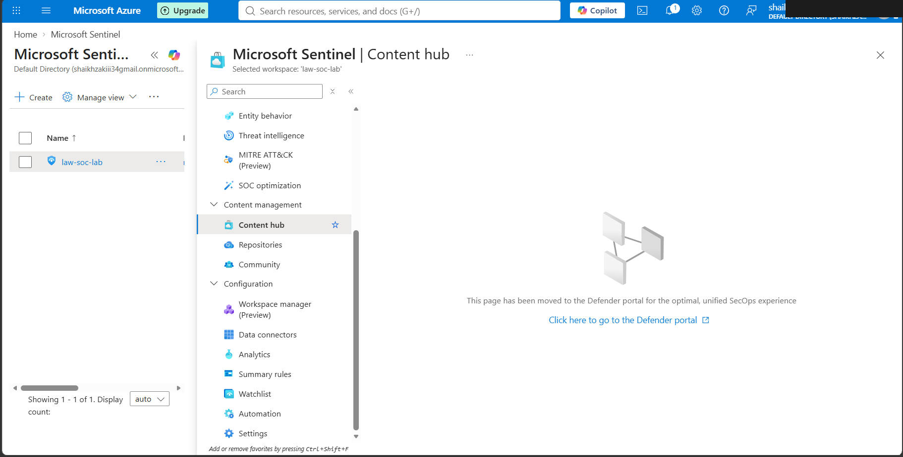
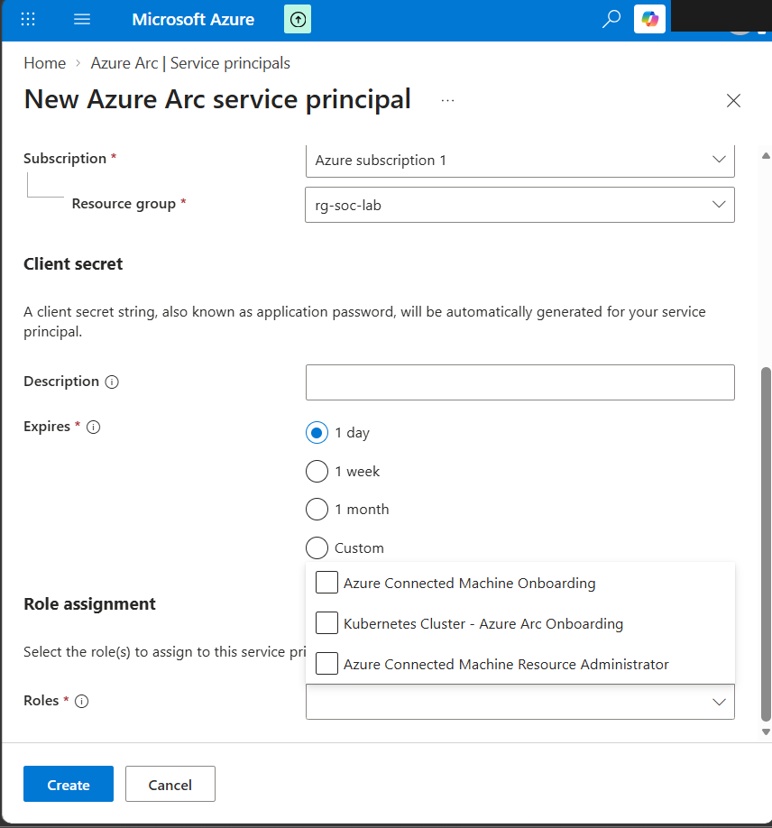
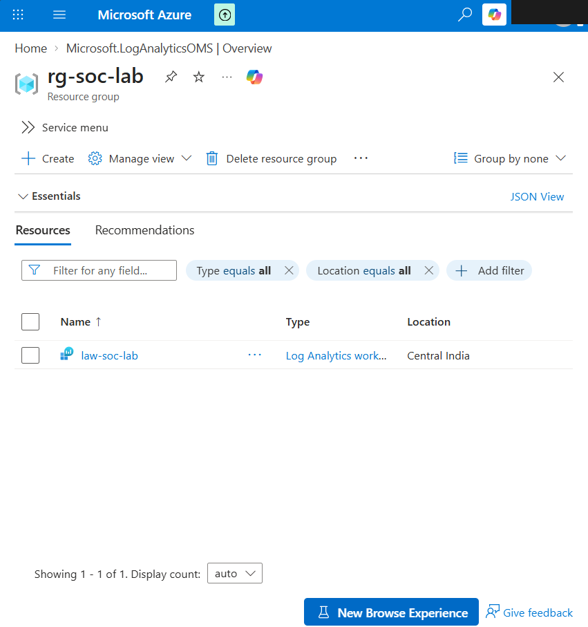
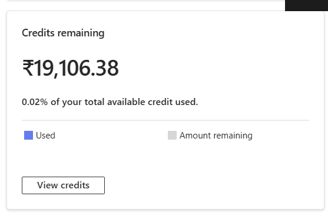
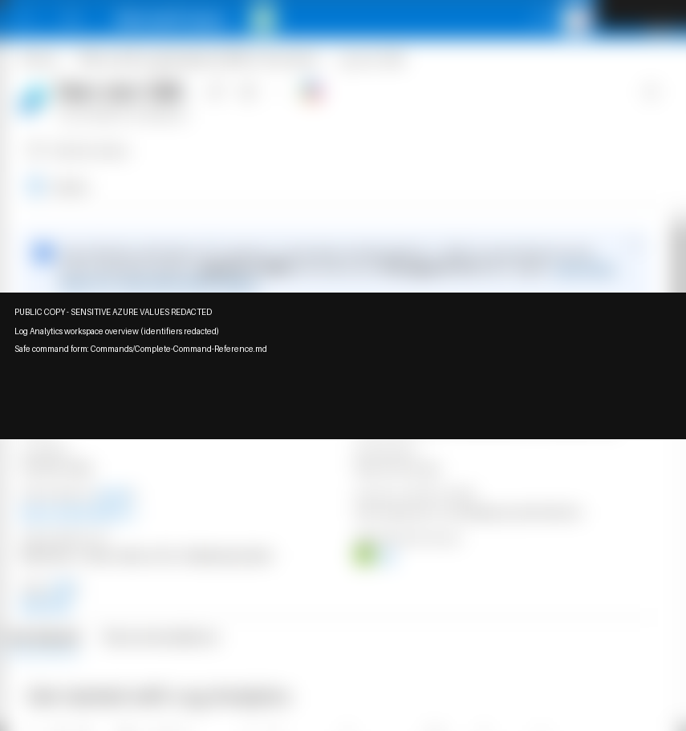
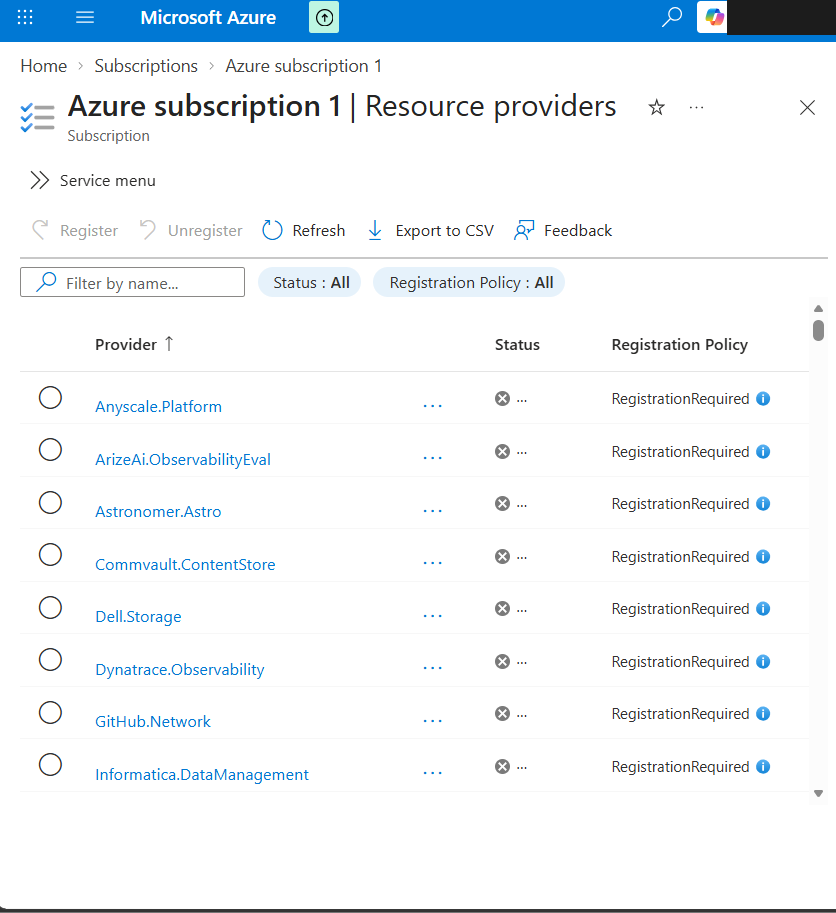
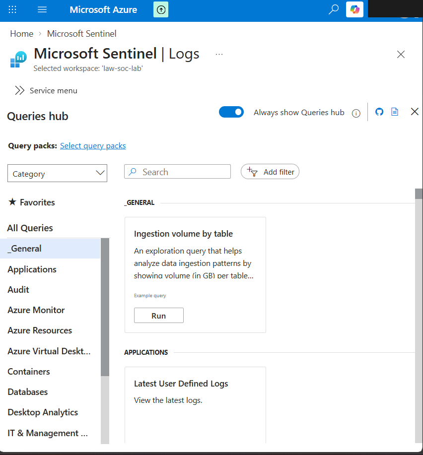
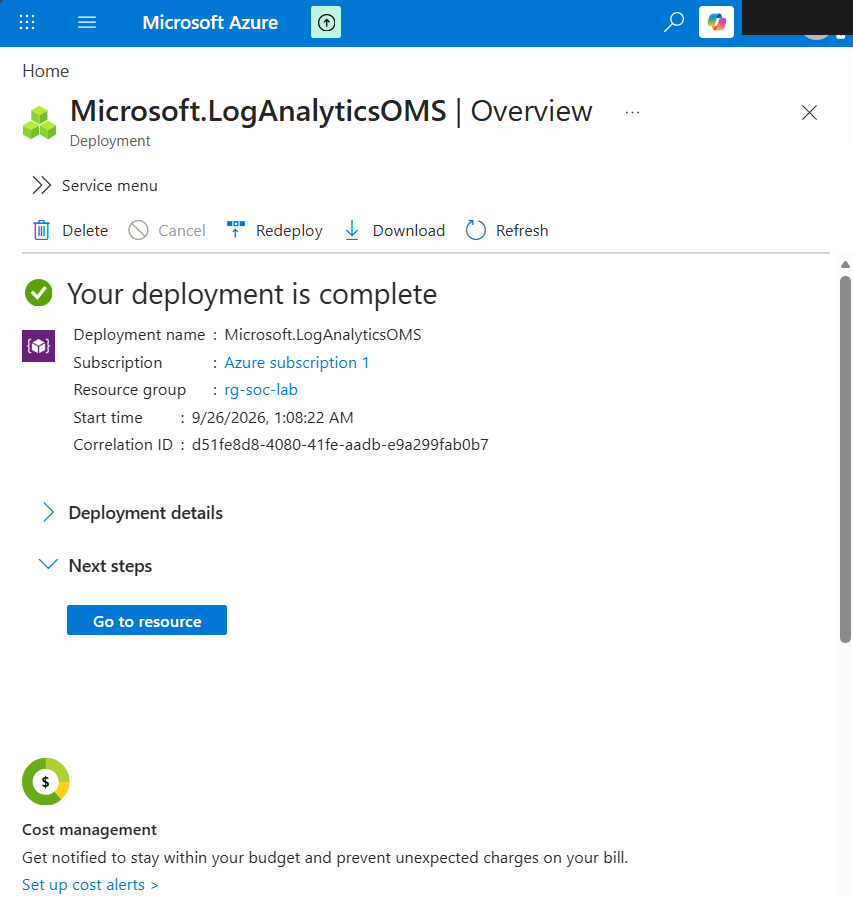

# Azure Foundation — Screenshot Gallery

Evidence images in this gallery: **8**

These are sanitized public copies. The complete 209-image manifest is in [`Evidence-Manifest.md`](Evidence-Manifest.md).

## Evidence 194 — Microsoft Sentinel Content Hub / workspace navigation

Source screenshot: `image(10).png`

## Evidence 195 — Create Azure service principal form (credential values intentionally not shown)

Source screenshot: `image.png`

## Evidence 198 — Log Analytics workspace listing

Source screenshot: `2d599c7d-5dd2-493b-8aa3-94846891b338.png`

## Evidence 199 — Azure credits remaining during lab

Source screenshot: `3d74552a-48dc-4ac7-a912-1b9adf36a875.png`

## Evidence 201 — Log Analytics workspace overview (identifiers redacted)

Source screenshot: `4c734dc8-2e64-4f30-bc28-e2de82626370.png`

## Evidence 202 — Azure subscription resource provider registration page

Source screenshot: `51630fb2-90d2-4184-97fb-8ca02616ffce.png`

## Evidence 208 — Microsoft Sentinel Logs initial view

Source screenshot: `c79bda75-5a46-4b6d-8f16-756b7171e0bf.png`

## Evidence 209 — Log Analytics workspace deployment complete

Source screenshot: `eeb49200-fb3e-477a-9dcf-9585a175538a.png`

