# Azure Monitor / AMA / DCR — Screenshot Gallery

Evidence images in this gallery: **23**

These are sanitized public copies. The complete 209-image manifest is in [`Evidence-Manifest.md`](Evidence-Manifest.md).

## Evidence 001 — Microsoft Sentinel content/solution search for Windows security integration

Source screenshot: `image(20260926-093205).png`

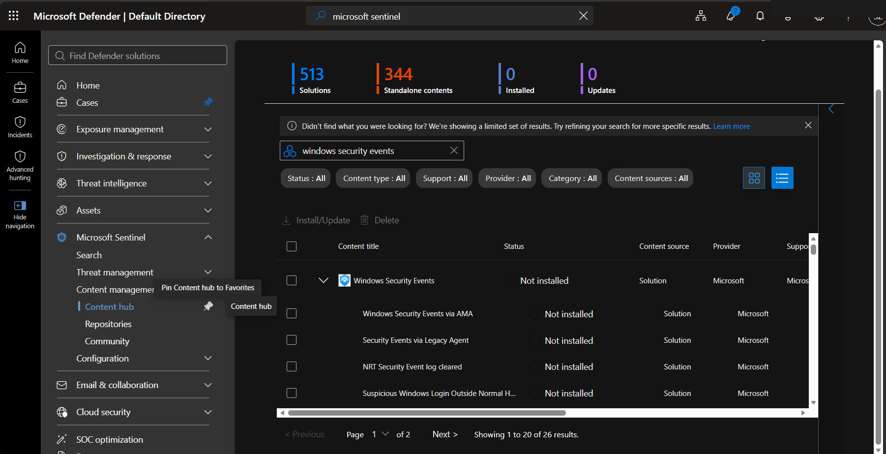

## Evidence 002 — Windows Security Events solution shown as installed

Source screenshot: `image(20260926-093420).png`

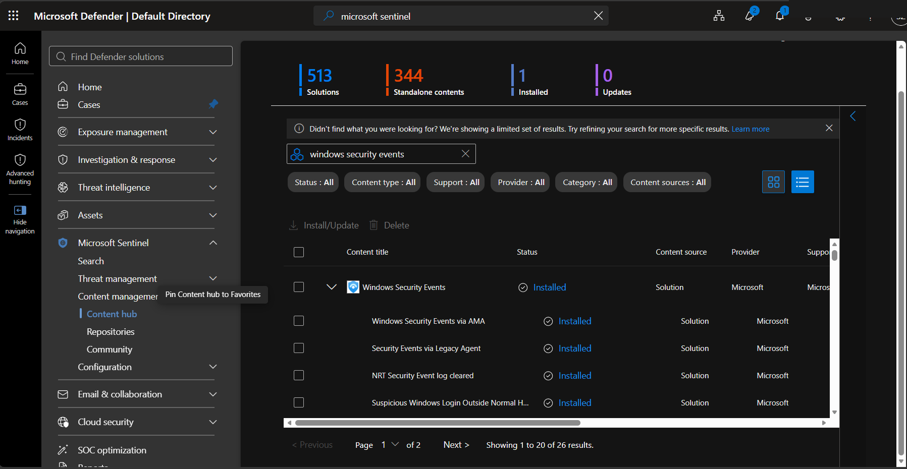

## Evidence 003 — Windows Security Events via AMA connector details

Source screenshot: `image(20260926-093740).png`

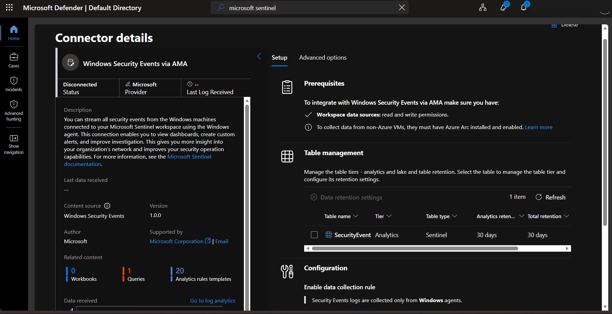

## Evidence 004 — Data Collection Rule wizard - security event collection selection

Source screenshot: `image(20260926-094016).png`

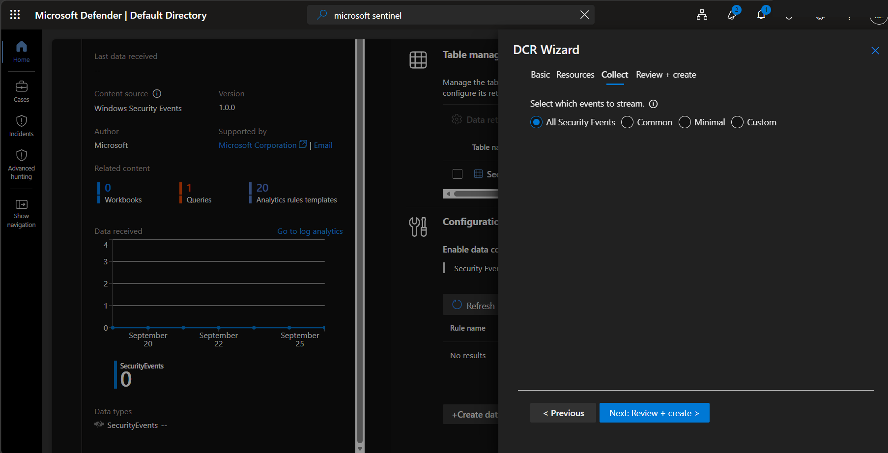

## Evidence 005 — DCR resource selection for DC01

Source screenshot: `image(20260926-094138).png`

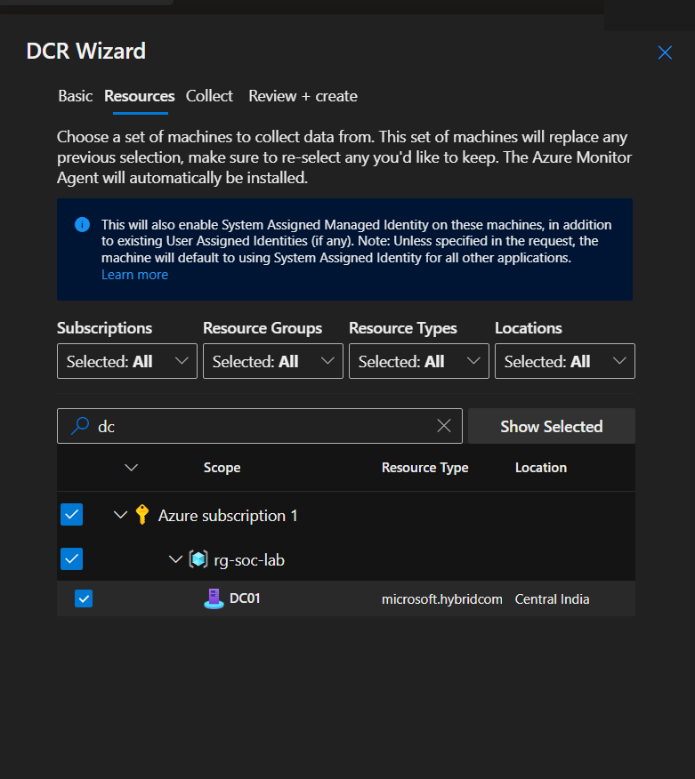

## Evidence 006 — Azure notifications confirming connector/DCR-related creation steps

Source screenshot: `image(20260926-094347).png`

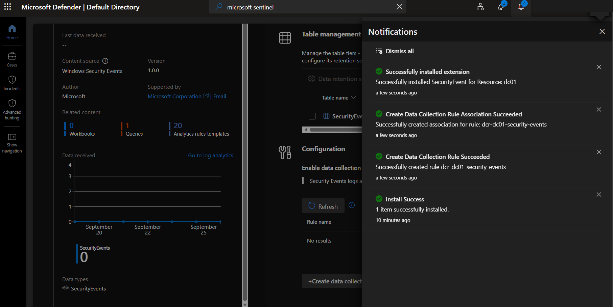

## Evidence 007 — Windows Security Events content details

Source screenshot: `image(20260926-094959).png`

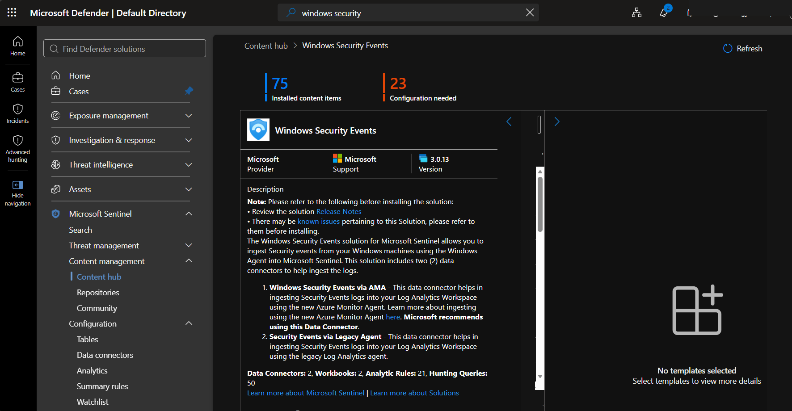

## Evidence 008 — Connector configuration / table management for SecurityEvent

Source screenshot: `image(20260926-095220).png`

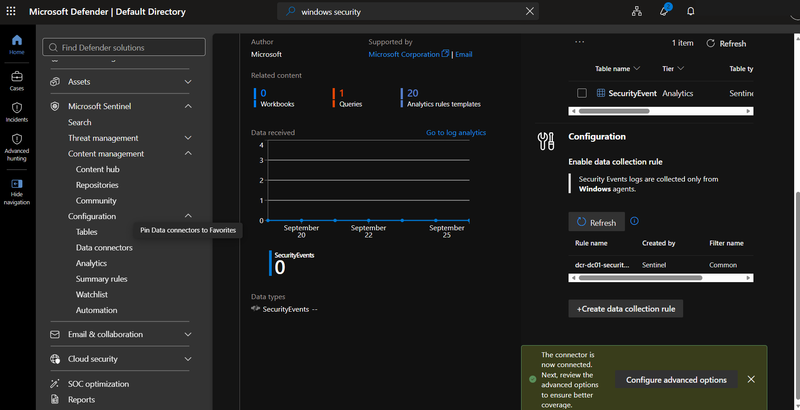

## Evidence 012 — PowerShell service check for Guest Configuration / extension services

Source screenshot: `image(20260926-101047).png`

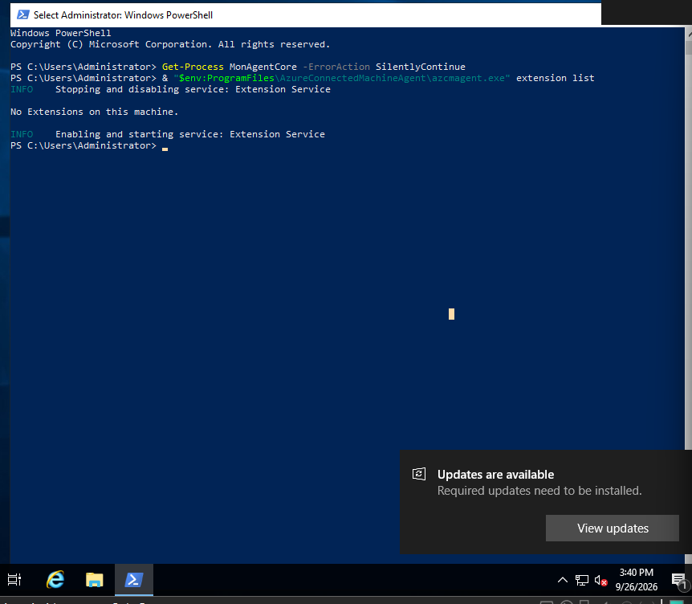

## Evidence 013 — Repeated extension service validation

Source screenshot: `image(20260926-101256).png`

## Evidence 014 — Azure Arc DC01 extension deployment view

Source screenshot: `image(20260926-101749).png`

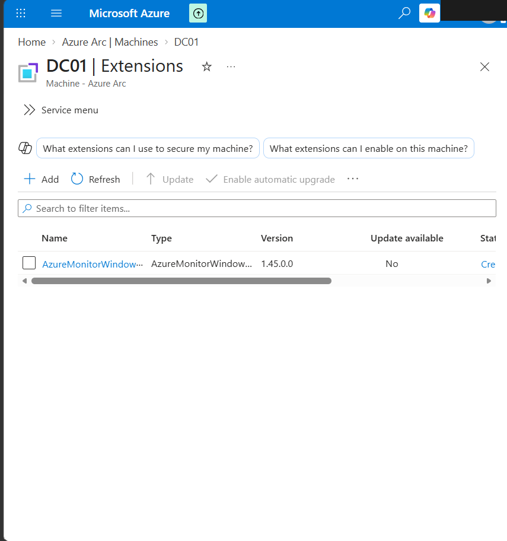

## Evidence 015 — Azure Monitor Agent extension in Creating state

Source screenshot: `image(20260926-101900).png`

## Evidence 016 — AMA extension still creating during troubleshooting

Source screenshot: `image(20260926-102357).png`

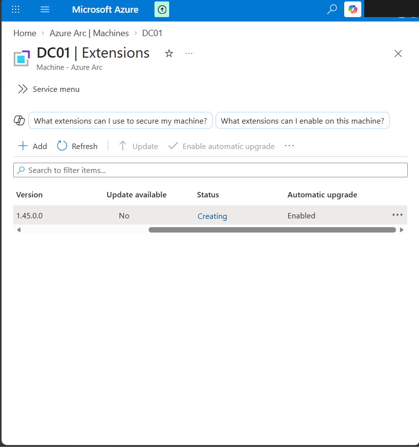

## Evidence 017 — AMA extension state/log output showing failure details

Source screenshot: `image(20260926-103213).png`

## Evidence 018 — Guest Configuration extension-manager logs used for troubleshooting

Source screenshot: `image(20260926-104412).png`

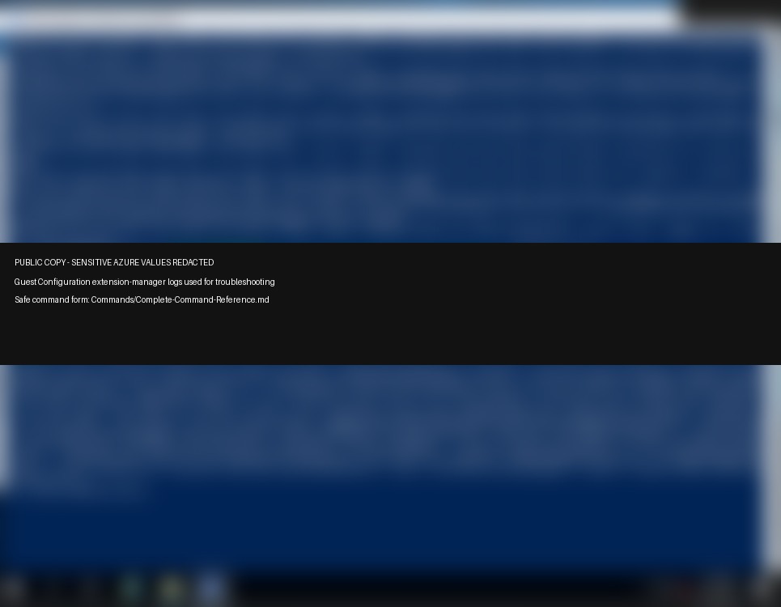

## Evidence 019 — Azure portal extension deployment retry / creating state

Source screenshot: `image(20260926-110151).png`

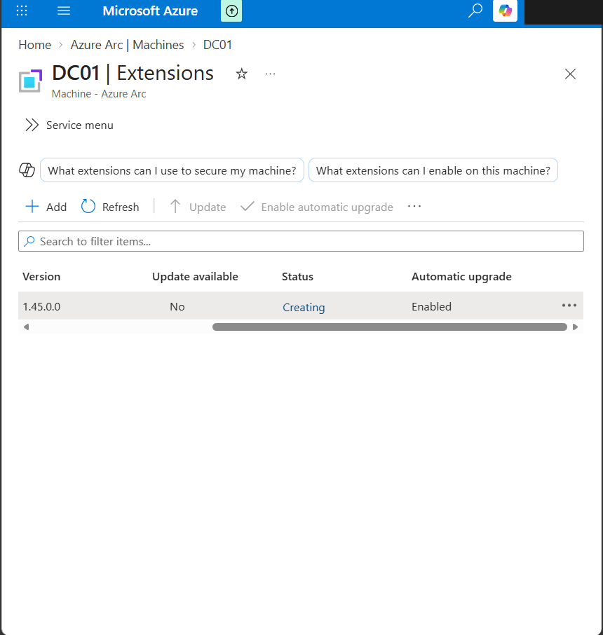

## Evidence 020 — Azure Monitor Agent extension succeeded

Source screenshot: `image(20260926-114303).png`

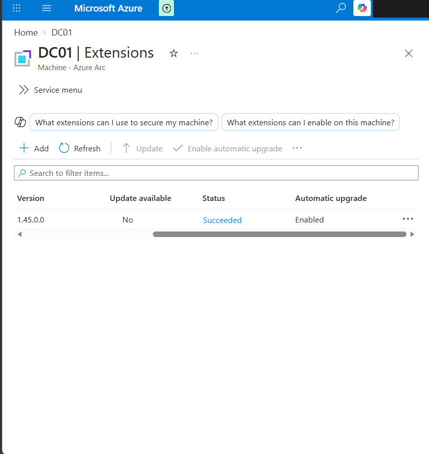

## Evidence 054 — Create Data Collection Rule - select DC01 as monitored resource

Source screenshot: `image(20260926-174503).png`

## Evidence 055 — DCR destination set to Log Analytics workspace

Source screenshot: `image(20260926-174521).png`

## Evidence 056 — Local Get-WinEvent validation for selected Sysmon event IDs

Source screenshot: `image(20260926-175019).png`

## Evidence 057 — Initial Sysmon DCR deployment failure

Source screenshot: `image(20260926-175411).png`

## Evidence 058 — DCR overview showing resource/data-flow relationship

Source screenshot: `image(20260926-175633).png`

## Evidence 059 — Successful DCR deployment

Source screenshot: `image(20260926-180025).png`

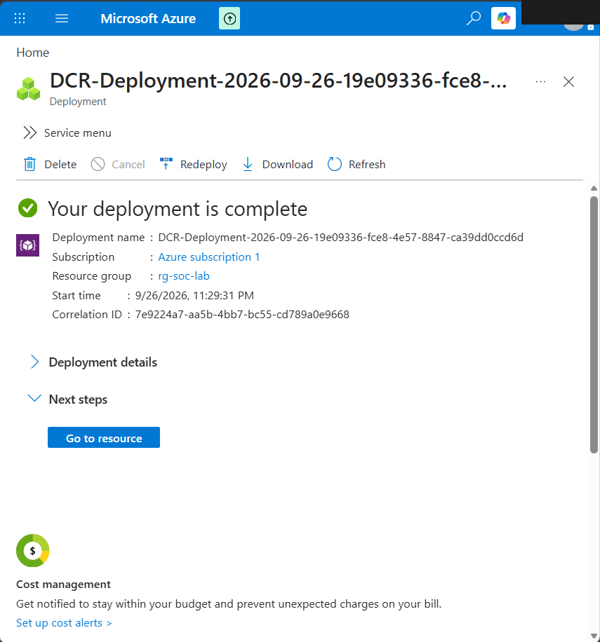
