# SecurityEvent / KQL — Screenshot Gallery

Evidence images in this gallery: **26**

These are sanitized public copies. The complete 209-image manifest is in [`Evidence-Manifest.md`](Evidence-Manifest.md).

## Evidence 009 — Initial Advanced Hunting query before telemetry appeared

Source screenshot: `image(20260926-095435).png`

## Evidence 010 — SecurityEvent validation query with no results during early setup

Source screenshot: `image(20260926-095729).png`

## Evidence 011 — Second early KQL validation attempt with no results

Source screenshot: `image(20260926-100042).png`

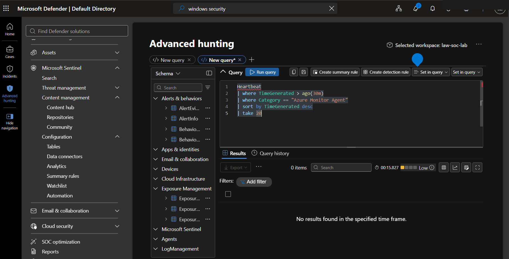

## Evidence 021 — SecurityEvent ingestion confirmed in Microsoft Sentinel

Source screenshot: `image(20260926-114705).png`

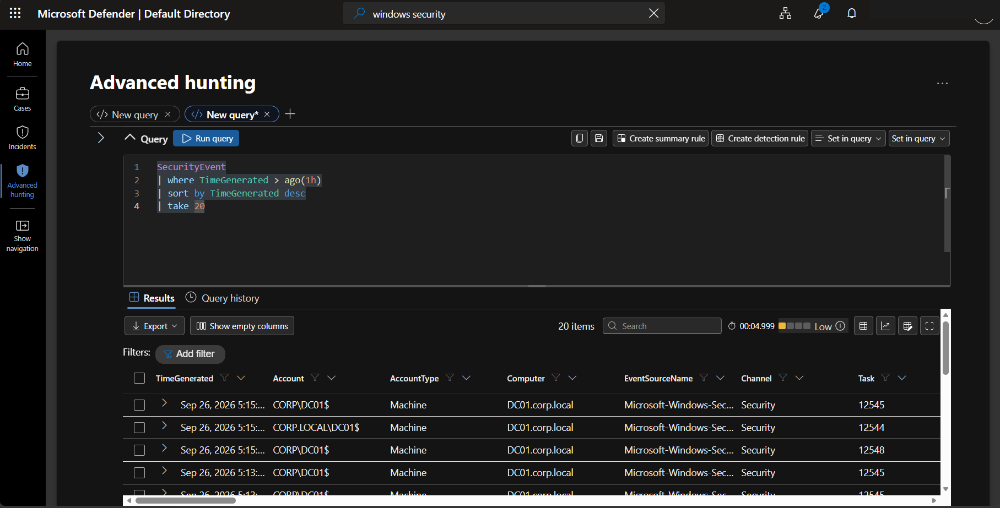

## Evidence 022 — Windows Security event counts grouped by Event ID

Source screenshot: `image(20260926-114813).png`

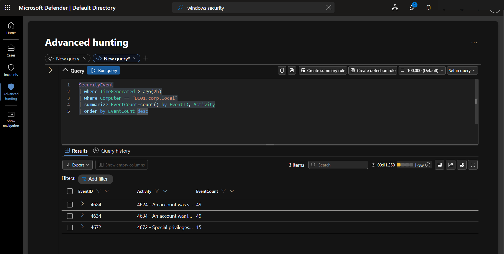

## Evidence 023 — Failed-logon fields inspected in SecurityEvent

Source screenshot: `image(20260926-114918).png`

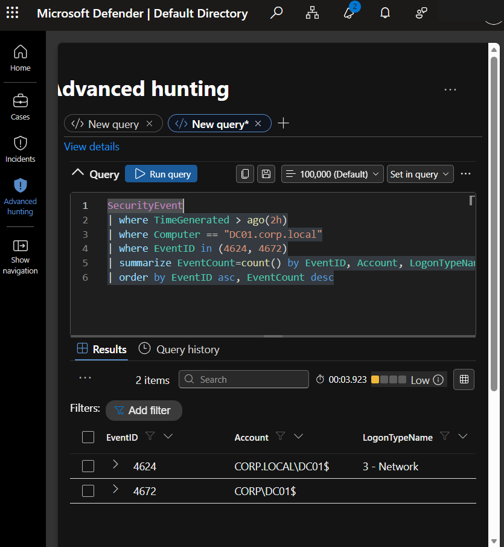

## Evidence 024 — Windows client net use authentication test against DC01

Source screenshot: `image(20260926-120216).png`

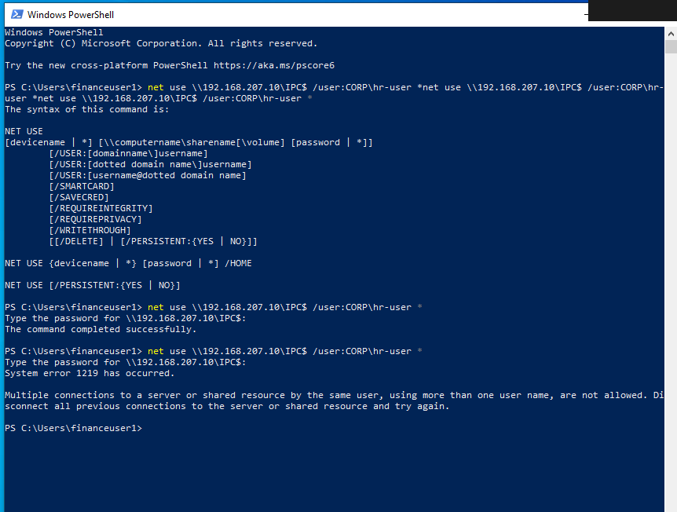

## Evidence 025 — Event 4625 failed-logon detail in Sentinel

Source screenshot: `image(20260926-120732).png`

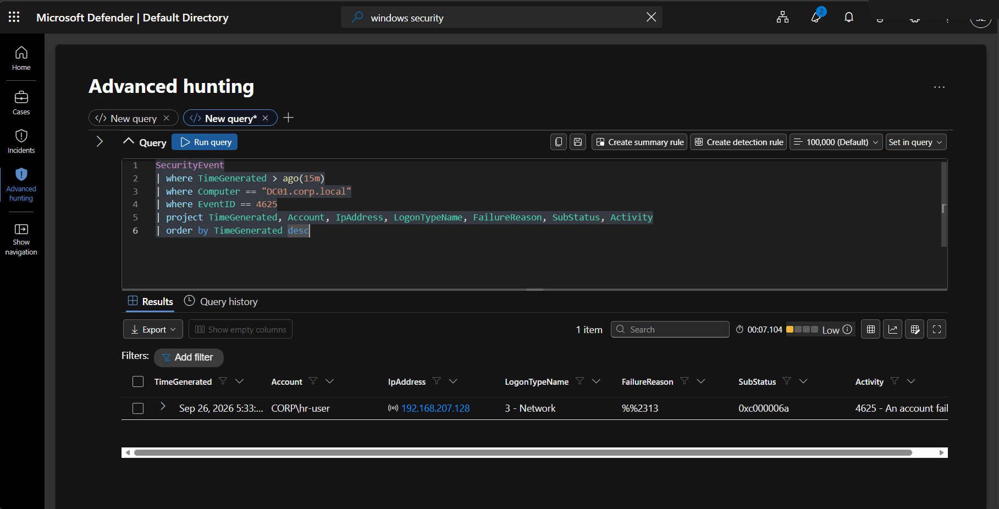

## Evidence 026 — Repeated failed-logon summary by account/source

Source screenshot: `image(20260926-123558).png`

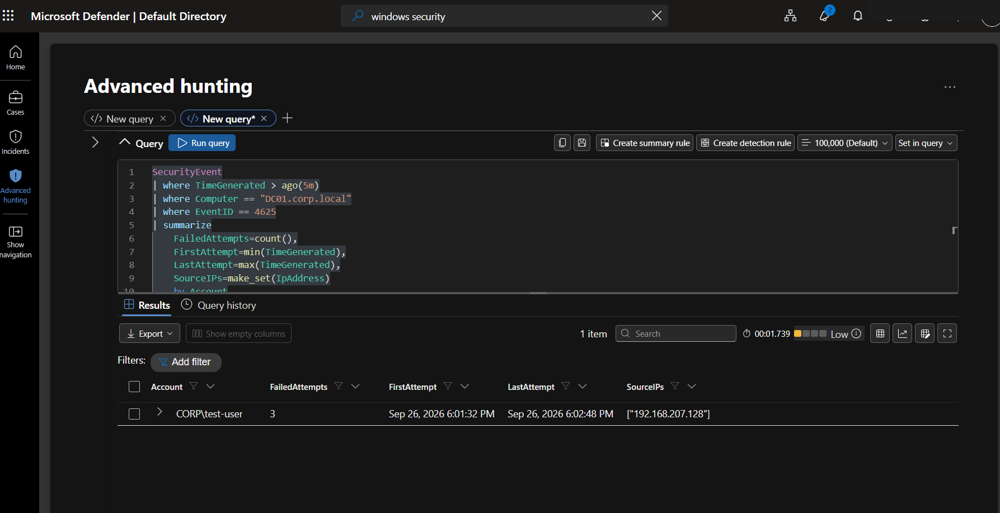

## Evidence 038 — Event 4625 query showing failed attempts from the client

Source screenshot: `image(20260926-164320).png`

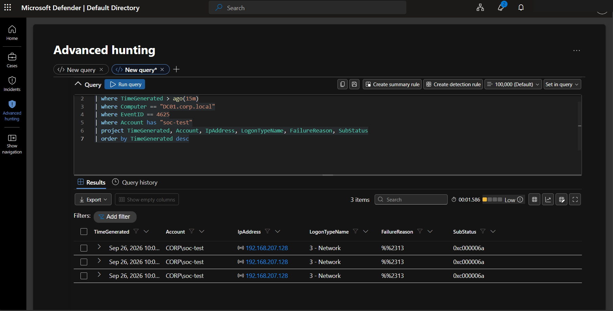

## Evidence 039 — KQL summary showing repeated failures for soc-test

Source screenshot: `image(20260926-164353).png`

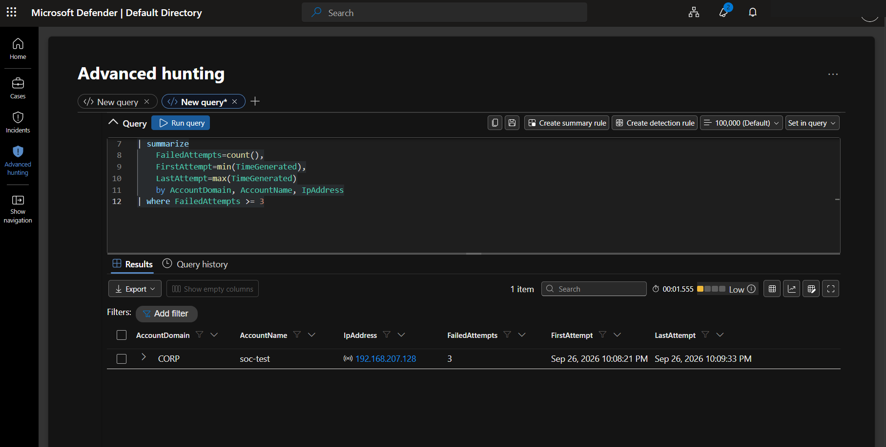

## Evidence 090 — Event ID 4720 query returning controlled account creation

Source screenshot: `image(20260926-193520).png`

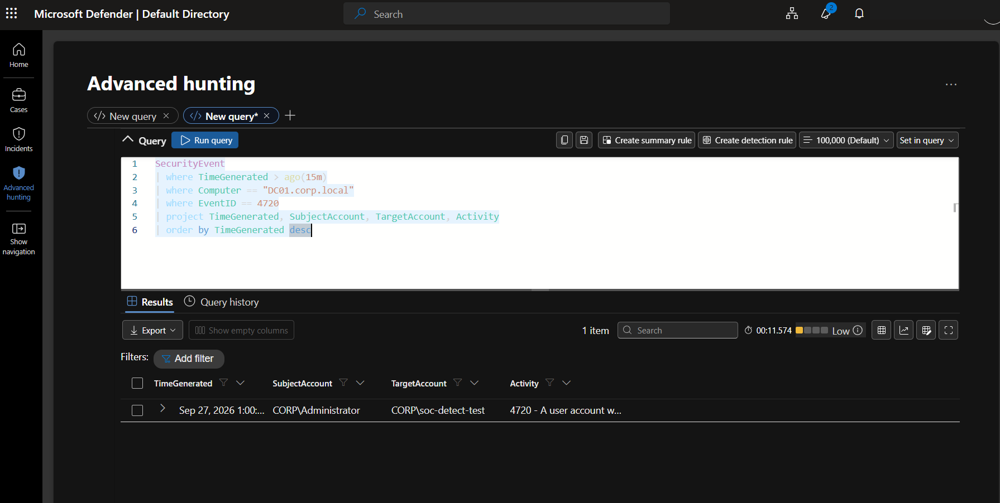

## Evidence 099 — Event 4728 query while waiting for ingestion

Source screenshot: `image(20260927-065629).png`

## Evidence 100 — Event 4728 appears in Sentinel

Source screenshot: `image(20260927-065905).png`

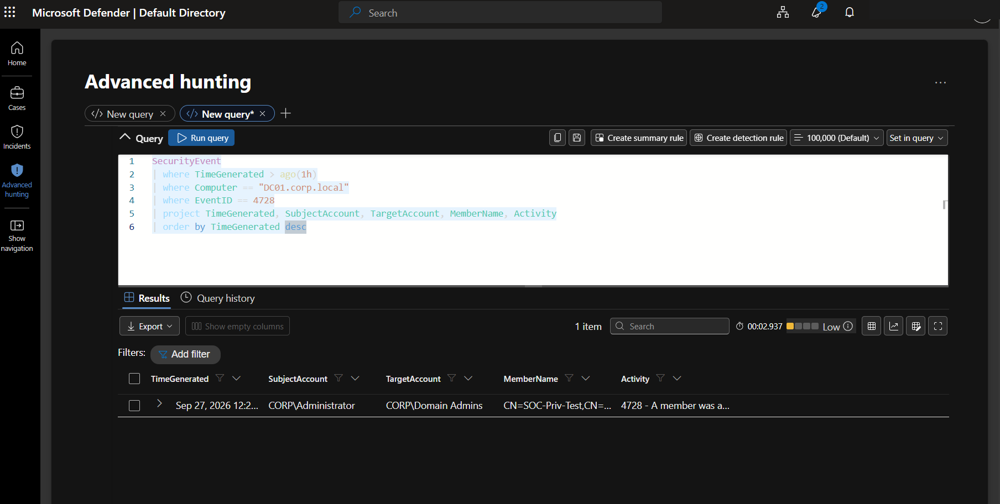

## Evidence 101 — Detailed privileged-group change query result

Source screenshot: `image(20260927-070039).png`

## Evidence 104 — KQL fields for privileged group membership change

Source screenshot: `image(20260927-073100).png`

## Evidence 109 — KQL showing both 4728 addition and 4729 removal events

Source screenshot: `image(20260927-080200).png`

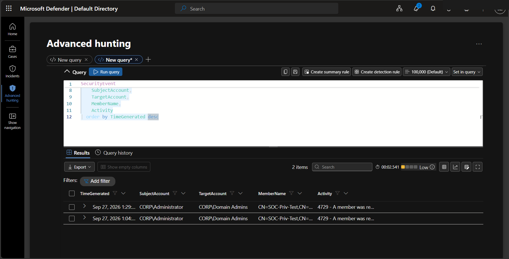

## Evidence 113 — PowerShell/Sysmon query returning a controlled process event

Source screenshot: `image(20260927-094001).png`

## Evidence 114 — Suspicious PowerShell indicator query with no rows during tuning

Source screenshot: `image(20260927-094246).png`

## Evidence 115 — Parsed PowerShell process result used to refine rule logic

Source screenshot: `image(20260927-094419).png`

## Evidence 117 — Final PowerShell detection query returning a controlled event

Source screenshot: `image(20260927-094754).png`

## Evidence 120 — PowerShell query with matching process telemetry

Source screenshot: `image(20260927-100837).png`

## Evidence 124 — Sysmon Event ID 13 query for Run-key persistence

Source screenshot: `image(20260927-103203).png`

## Evidence 129 — Sentinel query showing registry deletion telemetry

Source screenshot: `image(20260927-105631).png`

## Evidence 138 — Sentinel Event ID 4740 query result

Source screenshot: `image(20260927-114154).png`

## Evidence 143 — Sentinel Event ID 4767 recovery query

Source screenshot: `image(20260927-115428).png`

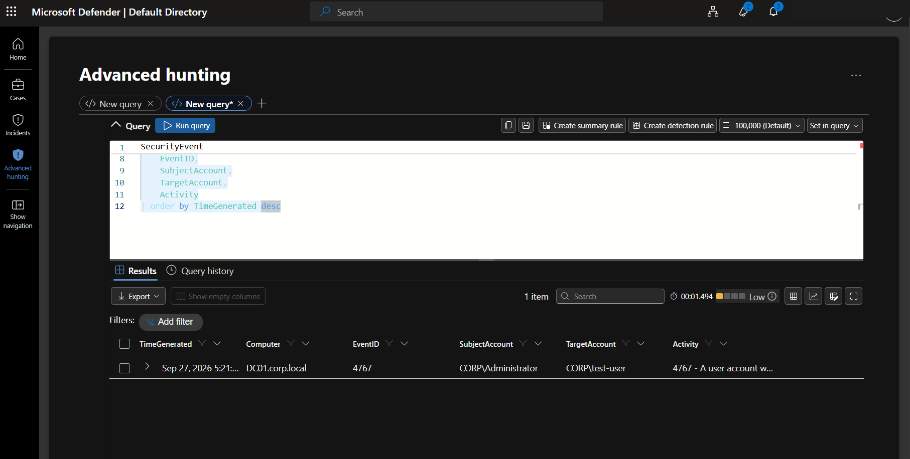
