# Incidents & Investigation — Screenshot Gallery

Evidence images in this gallery: **39**

These are sanitized public copies. The complete 209-image manifest is in [`Evidence-Manifest.md`](Evidence-Manifest.md).

## Evidence 040 — Incident queue showing the first failed-logon incident

Source screenshot: `image(20260926-164728).png`

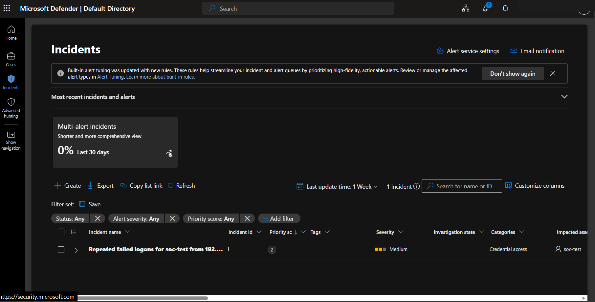

## Evidence 041 — Incident #1 - Repeated Failed Logons overview

Source screenshot: `image(20260926-164758).png`

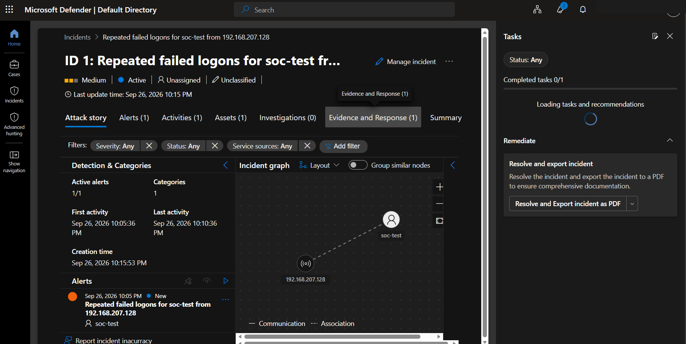

## Evidence 042 — Incident #1 alert details and rule description

Source screenshot: `image(20260926-165252).png`

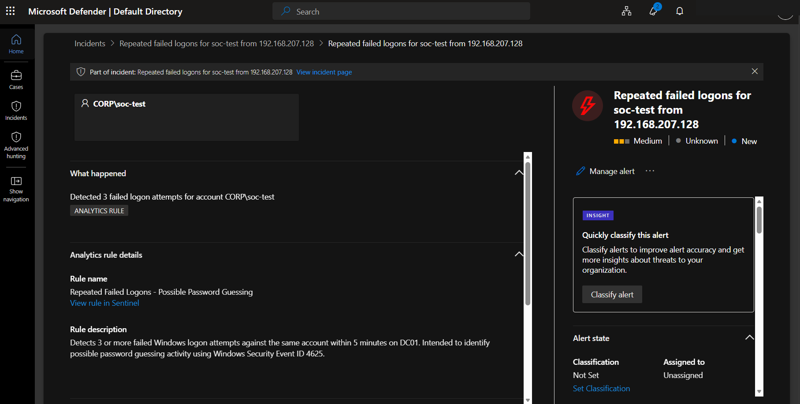

## Evidence 043 — Incident #1 related events / analytics details

Source screenshot: `image(20260926-165338).png`

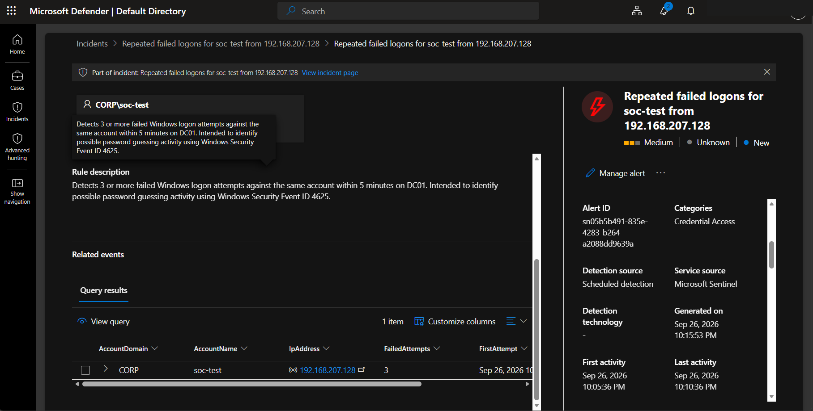

## Evidence 044 — Manage alert - classification workflow

Source screenshot: `image(20260926-165653).png`

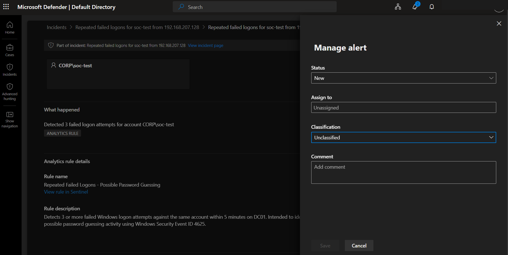

## Evidence 045 — Alert marked resolved/classified after authorized test

Source screenshot: `image(20260926-165933).png`

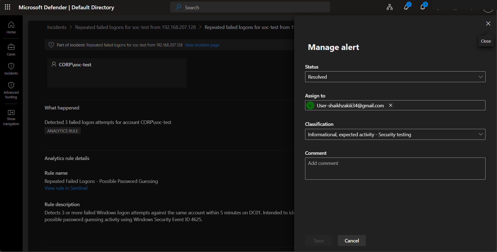

## Evidence 046 — Incident alert details with related event information

Source screenshot: `image(20260926-170239).png`

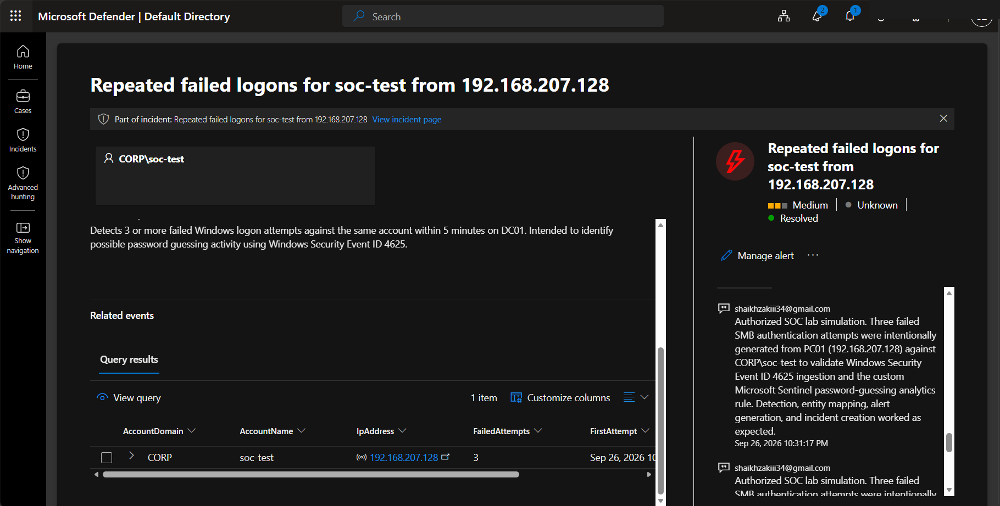

## Evidence 047 — Manage incident - final resolution/classification

Source screenshot: `image(20260926-170535).png`

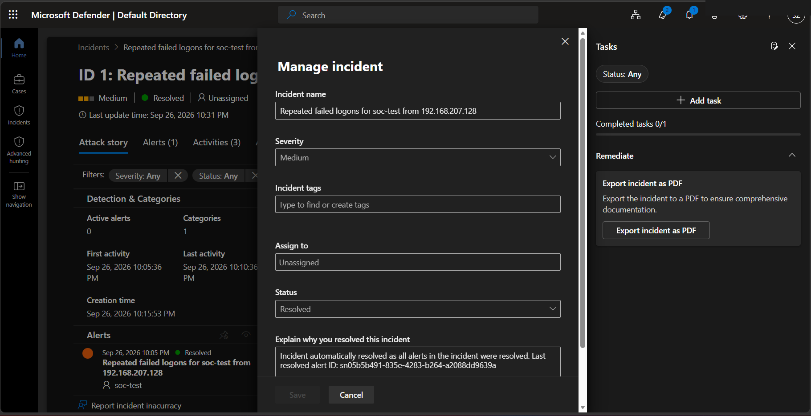

## Evidence 091 — Incident queue showing New AD User incident

Source screenshot: `image(20260926-194011).png`

## Evidence 092 — Incident #2 - New AD User created overview

Source screenshot: `image(20260926-194245).png`

## Evidence 093 — Incident #2 alert details

Source screenshot: `image(20260926-194414).png`

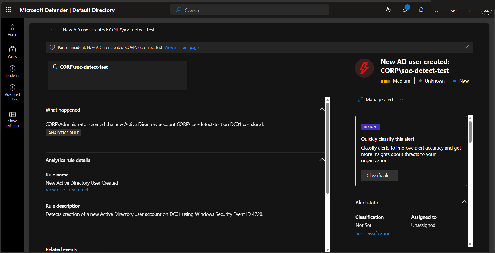

## Evidence 094 — Incident list after resolving controlled New AD User test

Source screenshot: `image(20260926-194825).png`

## Evidence 102 — Incidents view while waiting for privileged-group incident

Source screenshot: `image(20260927-070328).png`

## Evidence 103 — Incident queue after privileged group detection

Source screenshot: `image(20260927-072847).png`

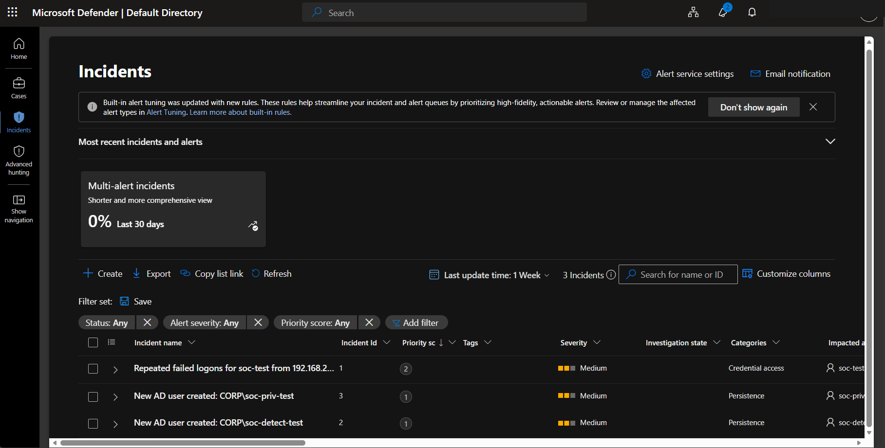

## Evidence 104 — KQL fields for privileged group membership change

Source screenshot: `image(20260927-073100).png`

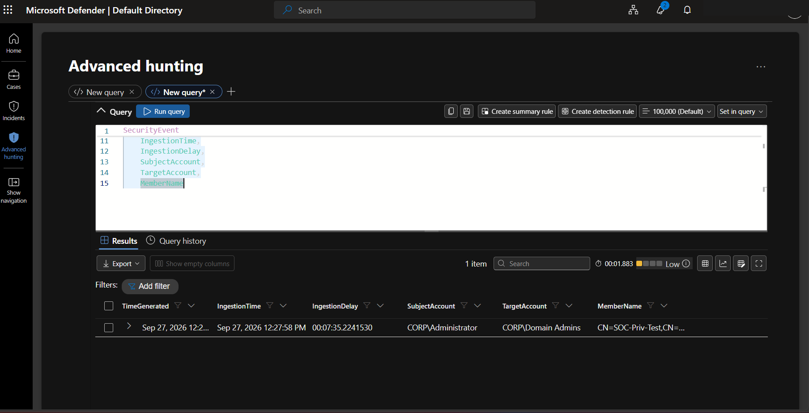

## Evidence 105 — Incident queue showing High-severity privileged group incident

Source screenshot: `image(20260927-075306).png`

## Evidence 106 — Incident #4 - Privileged group membership changed overview

Source screenshot: `image(20260927-075541).png`

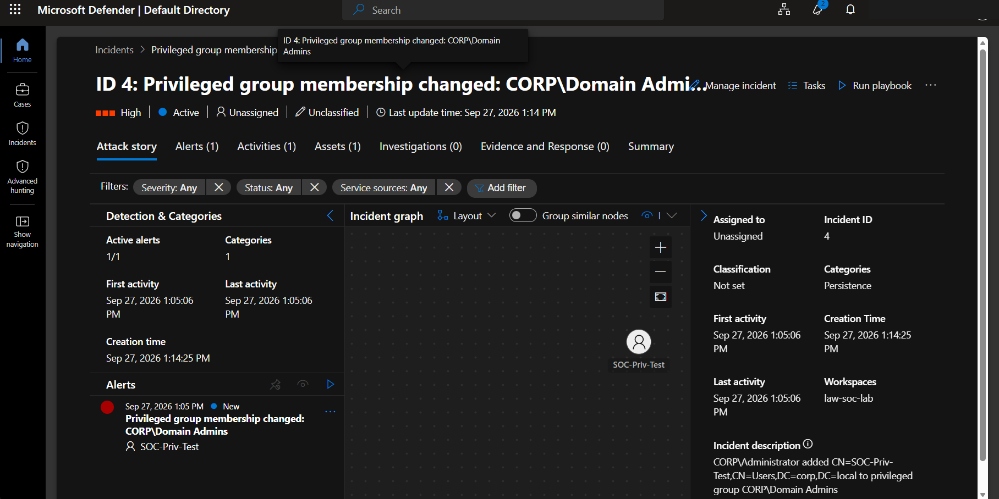

## Evidence 107 — Incident #4 custom details: actor, member, group and Event ID

Source screenshot: `image(20260927-075731).png`

## Evidence 116 — Incident queue while validating PowerShell rule timing

Source screenshot: `image(20260927-094535).png`

## Evidence 117 — Final PowerShell detection query returning a controlled event

Source screenshot: `image(20260927-094754).png`

## Evidence 118 — Incident queue after PowerShell detection test

Source screenshot: `image(20260927-100037).png`

## Evidence 119 — Analytics rule runs preview during troubleshooting

Source screenshot: `image(20260927-100348).png`

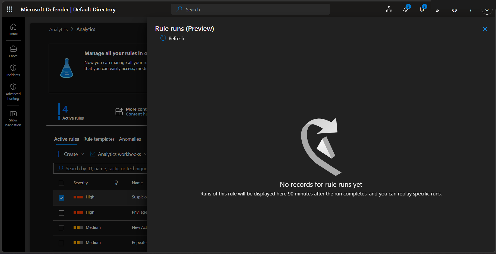

## Evidence 120 — PowerShell query with matching process telemetry

Source screenshot: `image(20260927-100837).png`

## Evidence 121 — Incident queue with Suspicious PowerShell incident

Source screenshot: `image(20260927-101205).png`

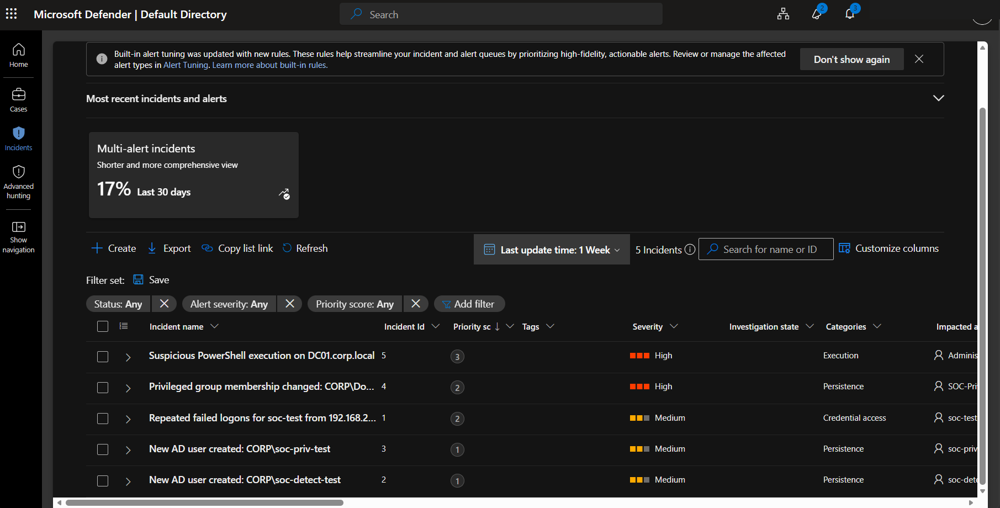

## Evidence 122 — Analytics rules list including Registry Run-Key Persistence

Source screenshot: `image(20260927-102648).png`

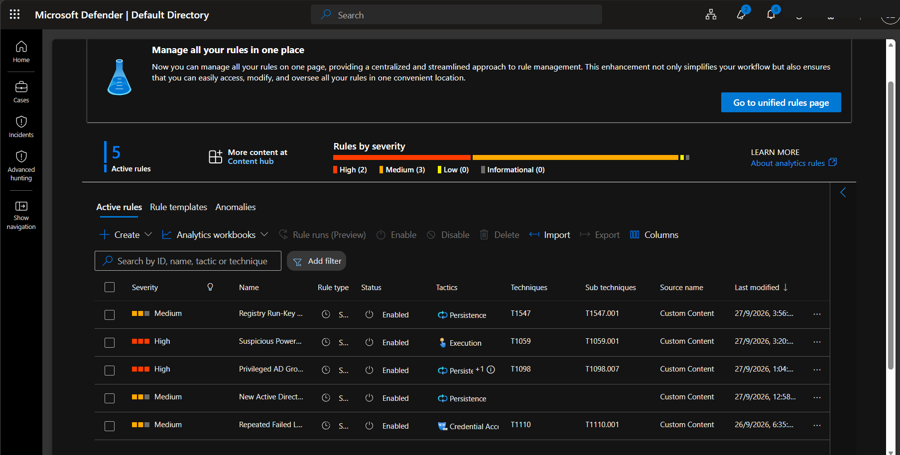

## Evidence 123 — Generate SOC-RULE4-FINAL-TEST and create SOC-Lab-Persistence-Test Run value

Source screenshot: `image(20260927-102945).png`

## Evidence 124 — Sysmon Event ID 13 query for Run-key persistence

Source screenshot: `image(20260927-103203).png`

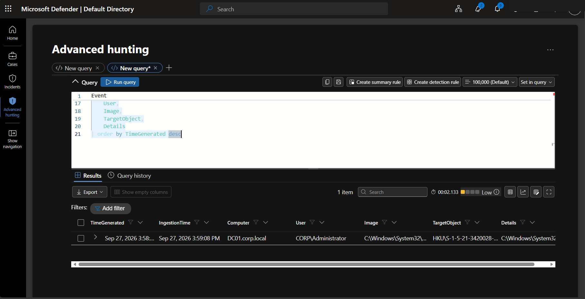

## Evidence 125 — Incident queue showing Registry Run-Key Persistence incident

Source screenshot: `image(20260927-103756).png`

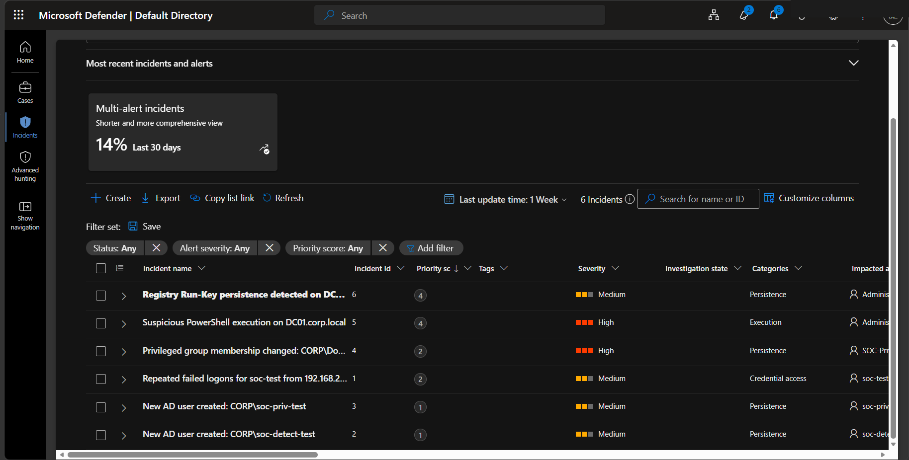

## Evidence 126 — Registry persistence alert details / custom fields

Source screenshot: `image(20260927-104831).png`

## Evidence 139 — Incident queue showing AD Account Lockout incident

Source screenshot: `image(20260927-114731).png`

## Evidence 140 — Account Lockout incident alert details with LockedAccount and CallerComputer

Source screenshot: `image(20260927-115016).png`

## Evidence 170 — Incident #7 PowerShell overview during first automation test

Source screenshot: `image(20260927-124728).png`

## Evidence 171 — Incident #7 grouped PowerShell alerts

Source screenshot: `image(20260927-125019).png`

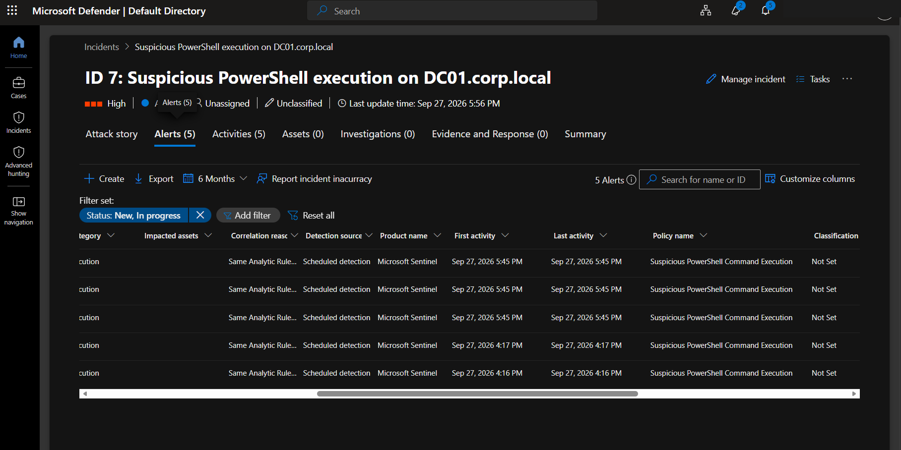

## Evidence 172 — Local SOAR test markers 1 and 2 with Sysmon Event ID 1 verification

Source screenshot: `image(20260927-125300).png`

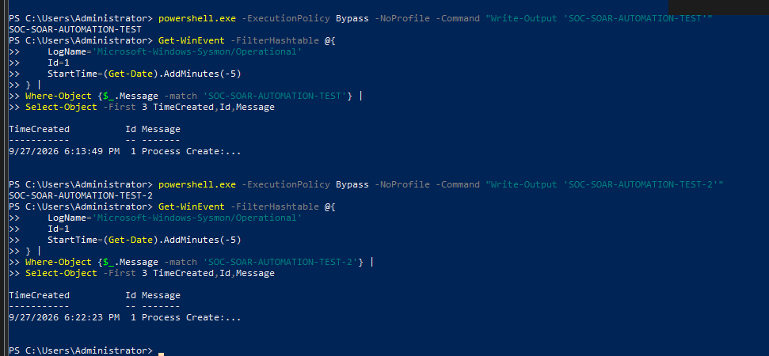

## Evidence 173 — Sentinel query for second automation test marker

Source screenshot: `image(20260927-125430).png`

## Evidence 174 — Incident #10 Tasks panel showing only default task

Source screenshot: `image(20260927-125711).png`

## Evidence 175 — Enhanced automation rule run history with no successful custom-task evidence

Source screenshot: `image(20260927-125957).png`

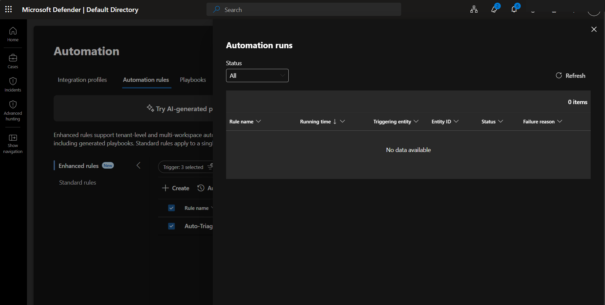

## Evidence 176 — Incident #10 Tasks panel confirming custom tasks were not added

Source screenshot: `image(20260927-132305).png`

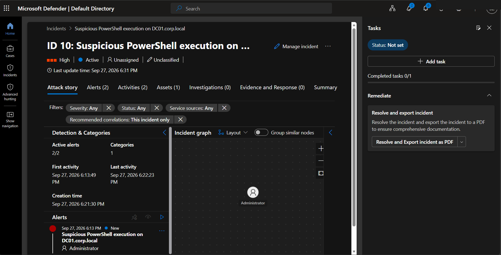

## Evidence 184 — Incident #11 with all three automatically-created investigation tasks

Source screenshot: `image(20260927-135440).png`

