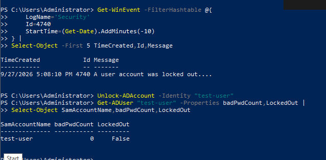

# Response & Containment — Screenshot Gallery

Evidence images in this gallery: **8**

These are sanitized public copies. The complete 209-image manifest is in [`Evidence-Manifest.md`](Evidence-Manifest.md).

## Evidence 108 — Remove soc-priv-test from Domain Admins and verify membership is gone

Source screenshot: `image(20260927-080000).png`

## Evidence 109 — KQL showing both 4728 addition and 4729 removal events

Source screenshot: `image(20260927-080200).png`

## Evidence 127 — Remove SOC-Lab-Persistence-Test and verify registry value absent

Source screenshot: `image(20260927-105134).png`

## Evidence 128 — Local Sysmon Event ID 12 deletion verification

Source screenshot: `image(20260927-105248).png`

## Evidence 129 — Sentinel query showing registry deletion telemetry

Source screenshot: `image(20260927-105631).png`

## Evidence 141 — Unlock-ADAccount response and state verification

Source screenshot: `image(20260927-115156).png`

## Evidence 142 — Local Security Event ID 4767 account-unlock verification

Source screenshot: `image(20260927-115259).png`

## Evidence 143 — Sentinel Event ID 4767 recovery query

Source screenshot: `image(20260927-115428).png`

