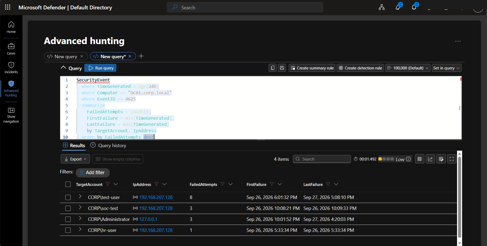
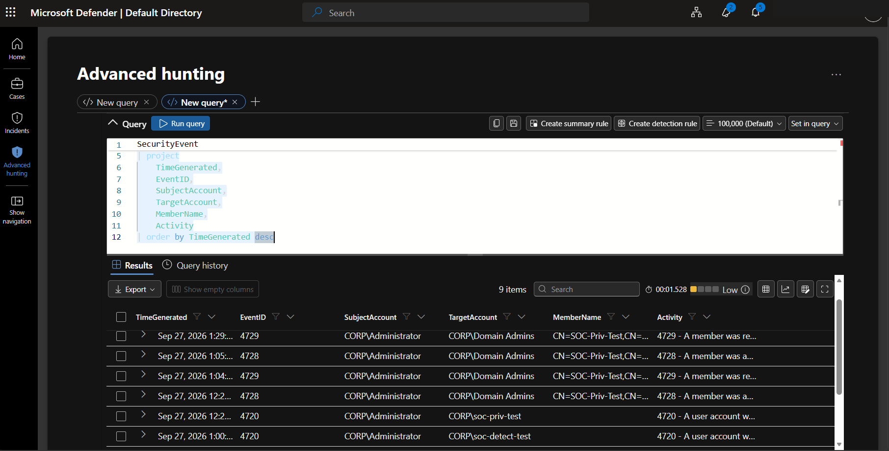
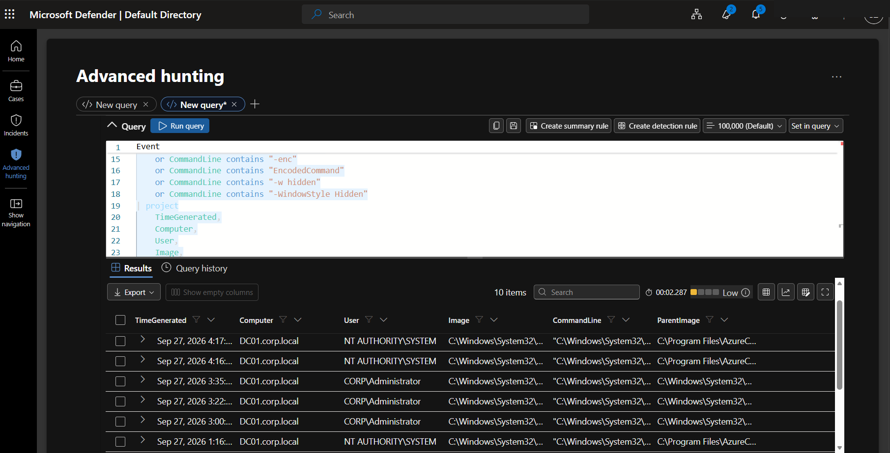
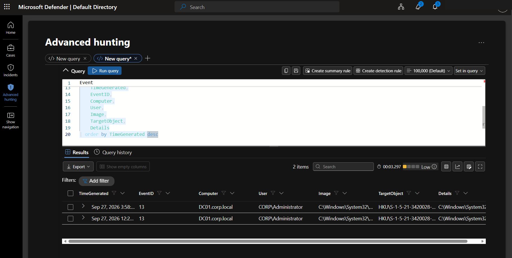
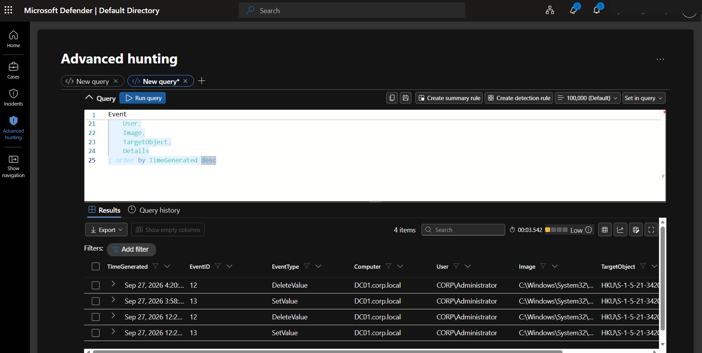
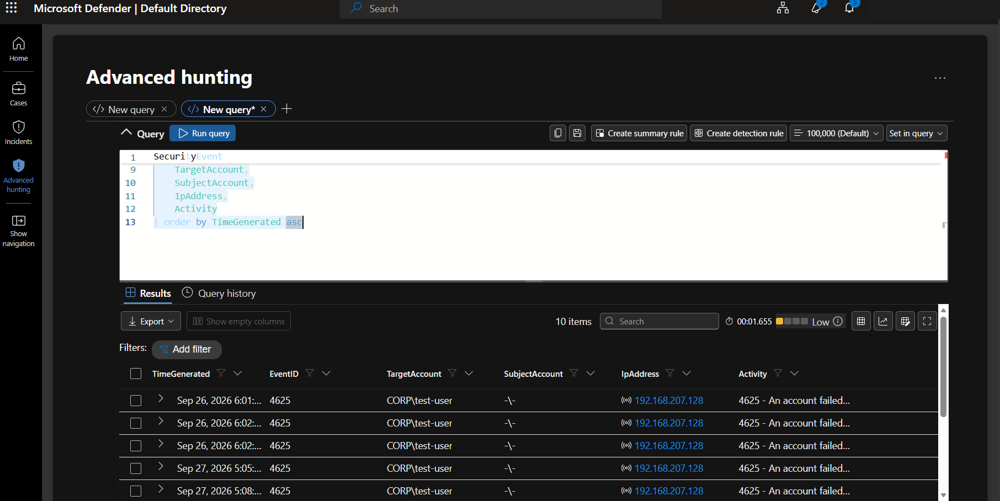
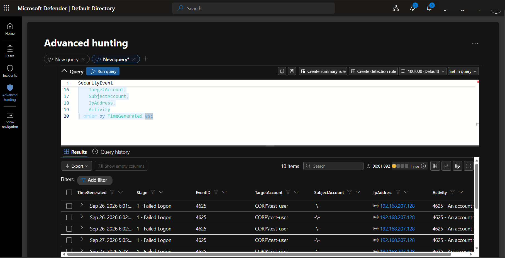
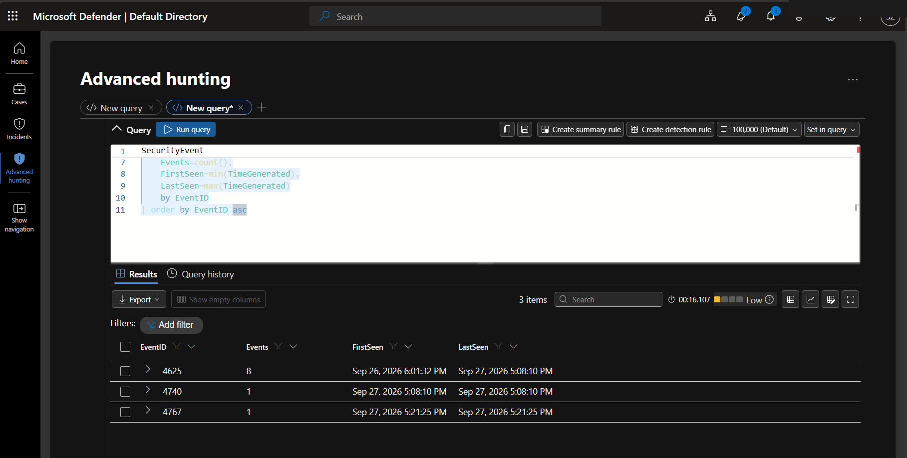

# Threat Hunting — Screenshot Gallery

Evidence images in this gallery: **9**

These are sanitized public copies. The complete 209-image manifest is in [`Evidence-Manifest.md`](Evidence-Manifest.md).

## Evidence 144 — Threat Hunt #1 - failed logon summary by account/source IP

Source screenshot: `image(20260927-115946).png`

## Evidence 145 — Threat Hunt #2 - AD account and group changes

Source screenshot: `image(20260927-120223).png`

## Evidence 146 — Threat Hunt #3 - suspicious PowerShell

Source screenshot: `image(20260927-120405).png`

## Evidence 147 — Threat Hunt #4 - registry persistence intermediate result

Source screenshot: `image(20260927-120517).png`

## Evidence 148 — Threat Hunt #4 - final SetValue/DeleteValue registry timeline

Source screenshot: `image(20260927-120649).png`

## Evidence 149 — Authentication event exploration during hunting

Source screenshot: `image(20260927-120842).png`

## Evidence 150 — Failed-logon activity details used for correlation

Source screenshot: `image(20260927-120951).png`

## Evidence 151 — Complex account timeline KQL error captured for troubleshooting

Source screenshot: `image(20260927-121158).png`

## Evidence 152 — Threat Hunt #5 - final compact account lockout/recovery timeline

Source screenshot: `image(20260927-121311).png`

