# Troubleshooting — Screenshot Gallery

Evidence images in this gallery: **27**

These are sanitized public copies. The complete 209-image manifest is in [`Evidence-Manifest.md`](Evidence-Manifest.md).

## Evidence 009 — Initial Advanced Hunting query before telemetry appeared

Source screenshot: `image(20260926-095435).png`

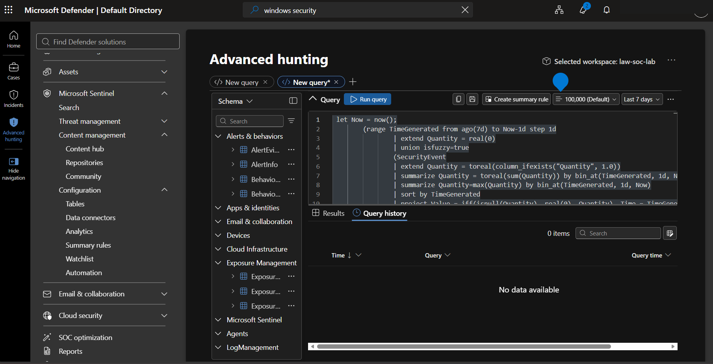

## Evidence 010 — SecurityEvent validation query with no results during early setup

Source screenshot: `image(20260926-095729).png`

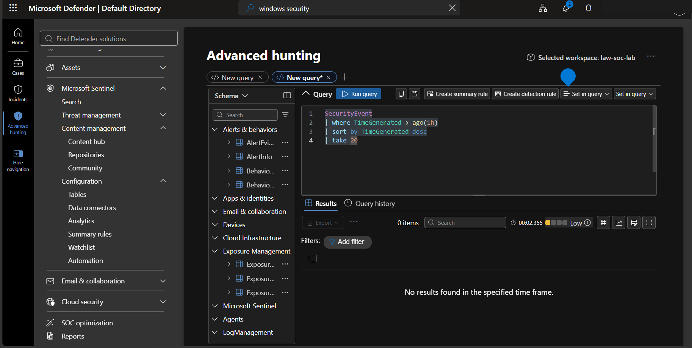

## Evidence 011 — Second early KQL validation attempt with no results

Source screenshot: `image(20260926-100042).png`

## Evidence 012 — PowerShell service check for Guest Configuration / extension services

Source screenshot: `image(20260926-101047).png`

## Evidence 013 — Repeated extension service validation

Source screenshot: `image(20260926-101256).png`

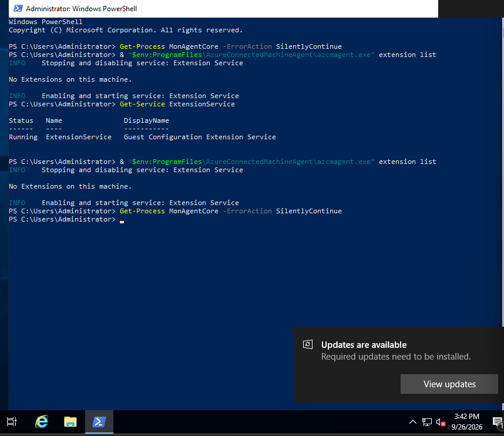

## Evidence 014 — Azure Arc DC01 extension deployment view

Source screenshot: `image(20260926-101749).png`

## Evidence 015 — Azure Monitor Agent extension in Creating state

Source screenshot: `image(20260926-101900).png`

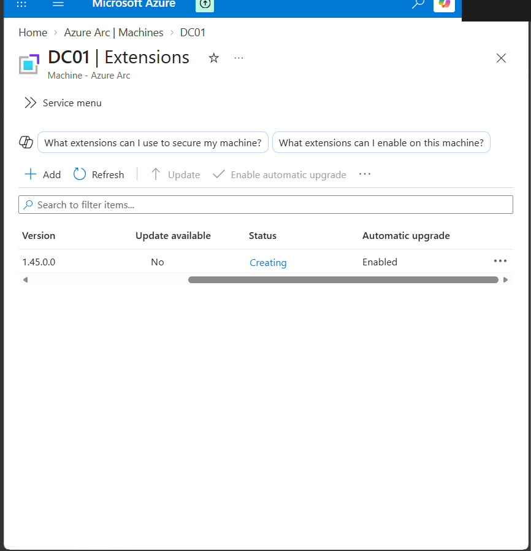

## Evidence 016 — AMA extension still creating during troubleshooting

Source screenshot: `image(20260926-102357).png`

## Evidence 017 — AMA extension state/log output showing failure details

Source screenshot: `image(20260926-103213).png`

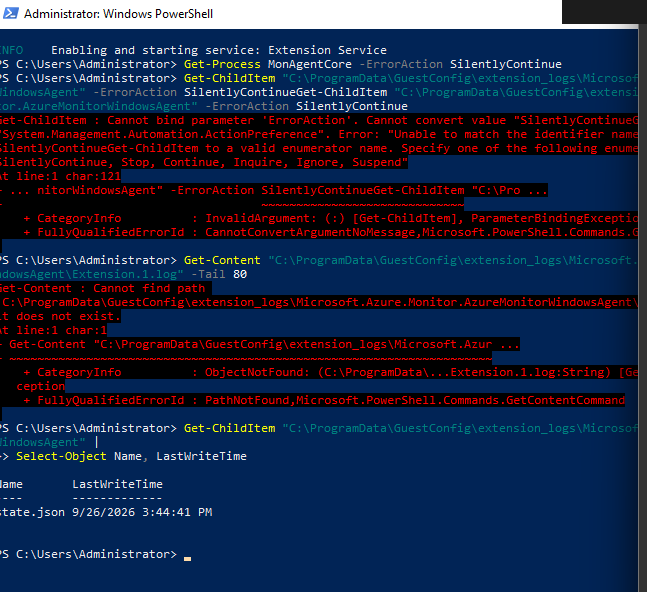

## Evidence 018 — Guest Configuration extension-manager logs used for troubleshooting

Source screenshot: `image(20260926-104412).png`

## Evidence 019 — Azure portal extension deployment retry / creating state

Source screenshot: `image(20260926-110151).png`

## Evidence 020 — Azure Monitor Agent extension succeeded

Source screenshot: `image(20260926-114303).png`

## Evidence 057 — Initial Sysmon DCR deployment failure

Source screenshot: `image(20260926-175411).png`

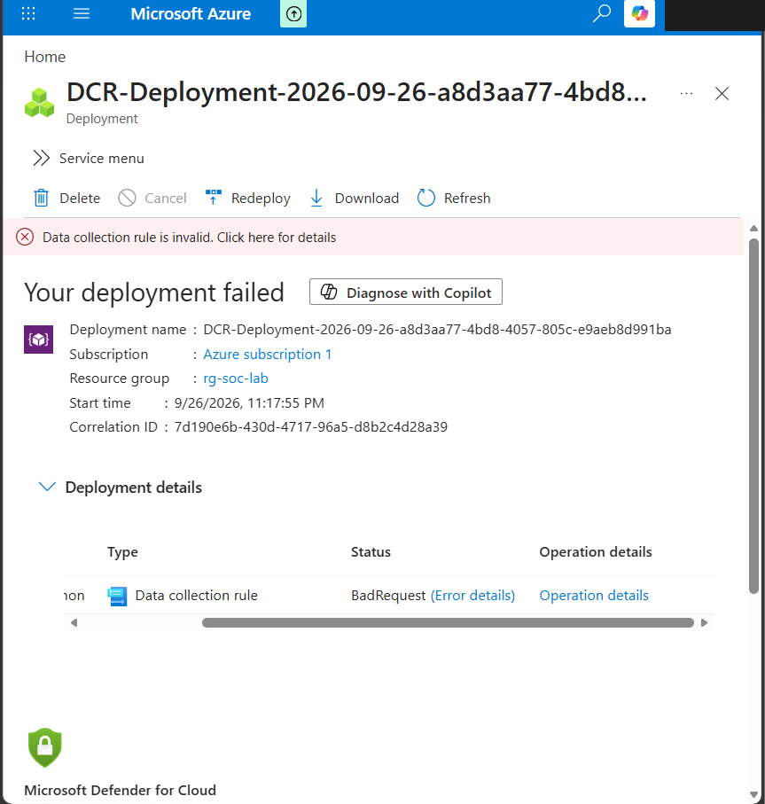

## Evidence 065 — Early suspicious PowerShell hunt returning no rows

Source screenshot: `image(20260926-183043).png`

## Evidence 066 — Alternative PowerShell detection query before matching activity existed

Source screenshot: `image(20260926-183311).png`

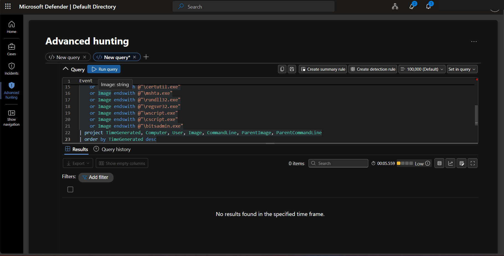

## Evidence 099 — Event 4728 query while waiting for ingestion

Source screenshot: `image(20260927-065629).png`

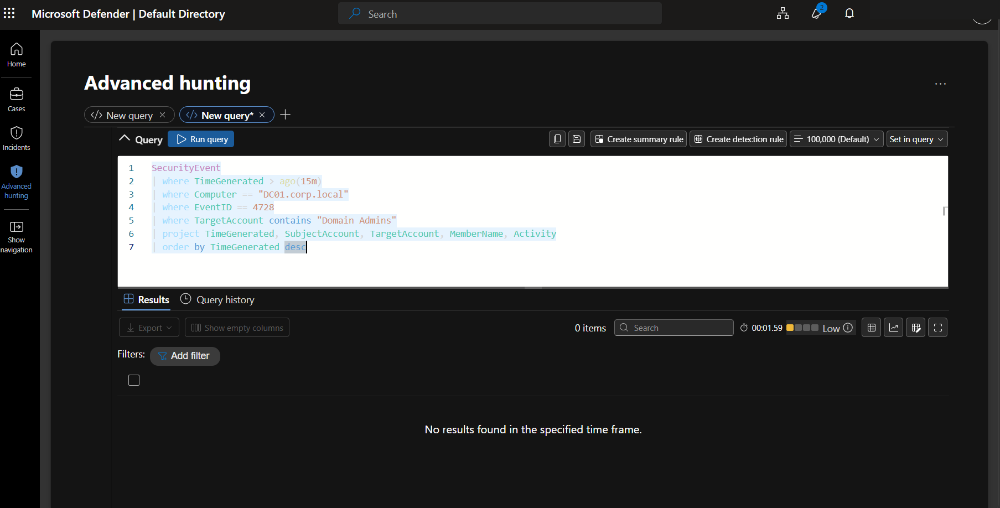

## Evidence 114 — Suspicious PowerShell indicator query with no rows during tuning

Source screenshot: `image(20260927-094246).png`

## Evidence 119 — Analytics rule runs preview during troubleshooting

Source screenshot: `image(20260927-100348).png`

## Evidence 151 — Complex account timeline KQL error captured for troubleshooting

Source screenshot: `image(20260927-121158).png`

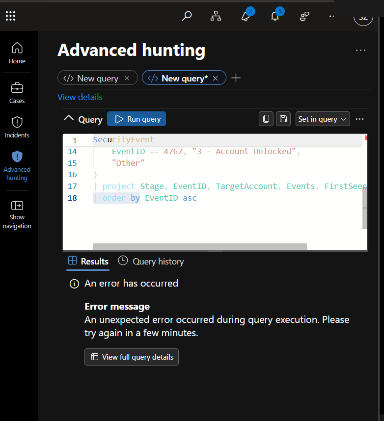

## Evidence 174 — Incident #10 Tasks panel showing only default task

Source screenshot: `image(20260927-125711).png`

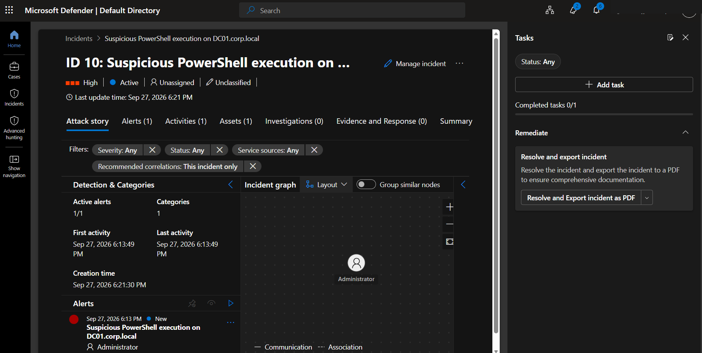

## Evidence 175 — Enhanced automation rule run history with no successful custom-task evidence

Source screenshot: `image(20260927-125957).png`

## Evidence 176 — Incident #10 Tasks panel confirming custom tasks were not added

Source screenshot: `image(20260927-132305).png`

## Evidence 185 — Initial Azure Arc connect attempt: device-code failure and service-principal variables (public copy redacted)

Source screenshot: `image(1).png`

## Evidence 186 — Azure Arc service-principal / tenant troubleshooting errors (public copy redacted)

Source screenshot: `image(2).png`

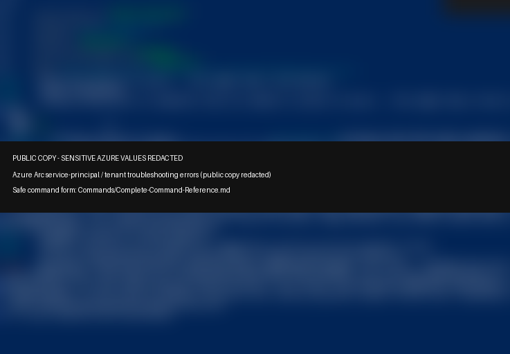

## Evidence 190 — Azure Arc connect attempt showing invalid client-secret error (public copy redacted)

Source screenshot: `image(6).png`

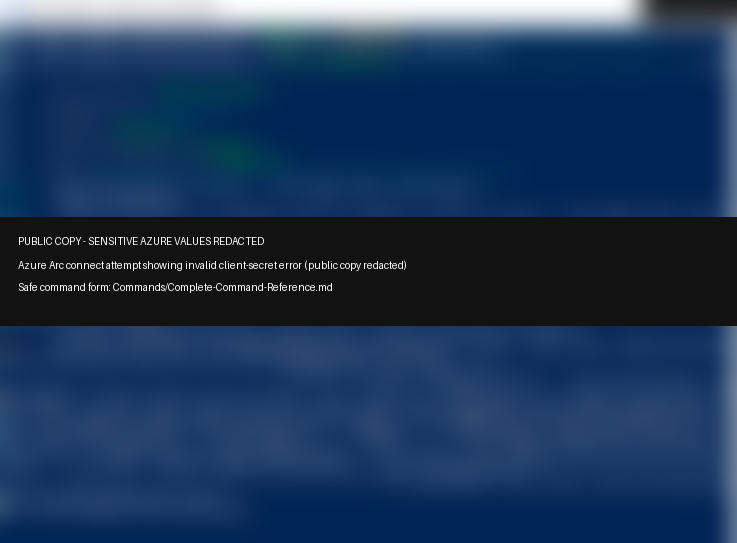

## Evidence 191 — Azure Arc service-principal connection attempt and resource creation output (redacted)

Source screenshot: `image(7).png`

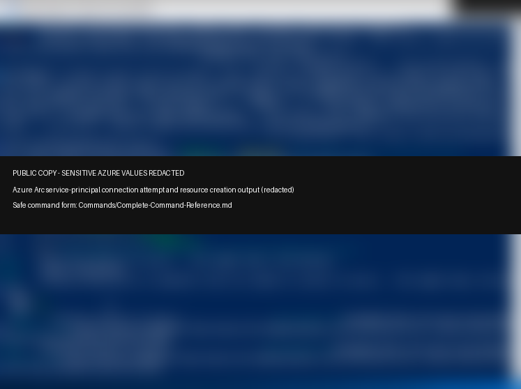

## Evidence 207 — Device-code browser sign-in blocked by security configuration

Source screenshot: `bf51b175-379f-4775-afb0-4ae16a0b261e.png`

