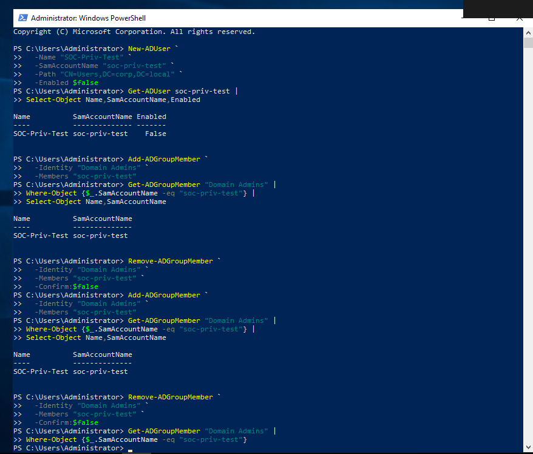
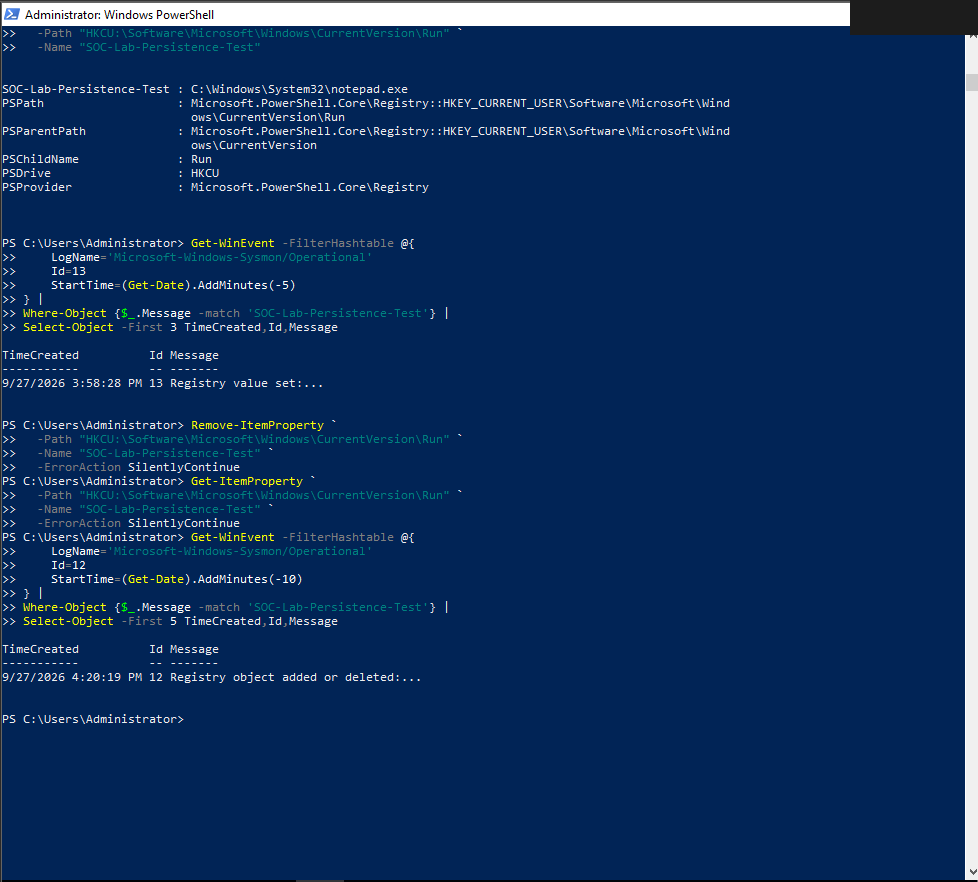
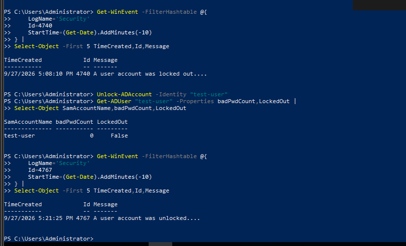

# Security Cleanup — Screenshot Gallery

Evidence images in this gallery: **13**

These are sanitized public copies. The complete 209-image manifest is in [`Evidence-Manifest.md`](Evidence-Manifest.md).

## Evidence 083 — Azure subscription IAM showing temporary service-principal Contributor access

Source screenshot: `image(20260926-191242).png`

## Evidence 084 — Azure subscription IAM after temporary access cleanup

Source screenshot: `image(20260926-191356).png`

## Evidence 085 — App registration Certificates & secrets showing zero client secrets

Source screenshot: `image(20260926-191540).png`

## Evidence 087 — PowerShell cleanup checks for test AD group and registry value

Source screenshot: `image(20260926-191807).png`

## Evidence 094 — Incident list after resolving controlled New AD User test

Source screenshot: `image(20260926-194825).png`

## Evidence 108 — Remove soc-priv-test from Domain Admins and verify membership is gone

Source screenshot: `image(20260927-080000).png`

## Evidence 109 — KQL showing both 4728 addition and 4729 removal events

Source screenshot: `image(20260927-080200).png`

## Evidence 127 — Remove SOC-Lab-Persistence-Test and verify registry value absent

Source screenshot: `image(20260927-105134).png`

## Evidence 128 — Local Sysmon Event ID 12 deletion verification

Source screenshot: `image(20260927-105248).png`

## Evidence 129 — Sentinel query showing registry deletion telemetry

Source screenshot: `image(20260927-105631).png`

## Evidence 141 — Unlock-ADAccount response and state verification

Source screenshot: `image(20260927-115156).png`

## Evidence 142 — Local Security Event ID 4767 account-unlock verification

Source screenshot: `image(20260927-115259).png`

## Evidence 143 — Sentinel Event ID 4767 recovery query

Source screenshot: `image(20260927-115428).png`

